# API Architecture Documentation

## REST API Design

The Investment Portfolio Management System exposes a comprehensive REST API following RESTful principles and industry best practices. The API provides complete CRUD operations for all domain entities plus specialized endpoints for reporting and analytics.

## API Architecture Overview

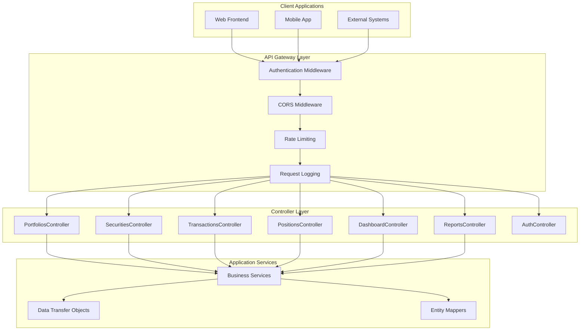

## Authentication Flow

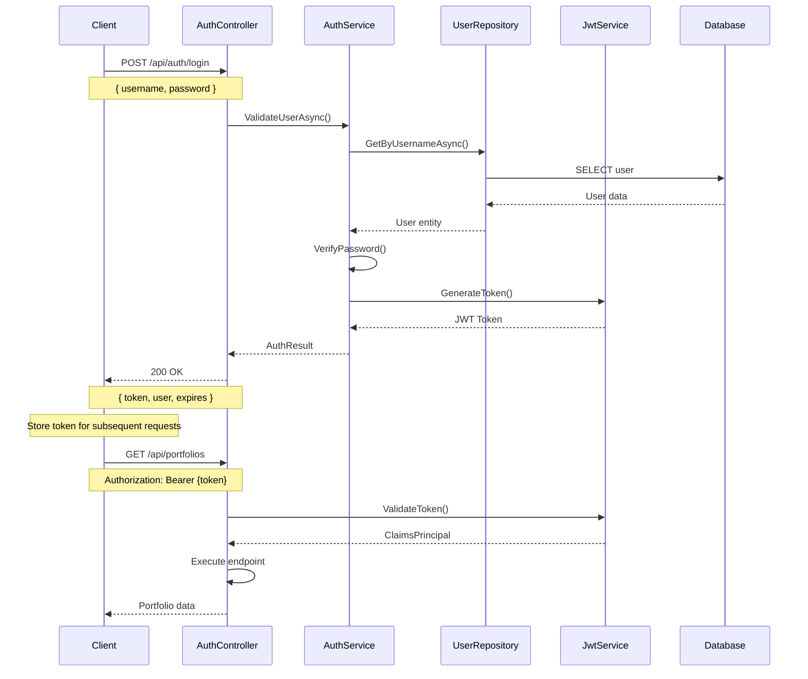

## Controller Architecture Pattern

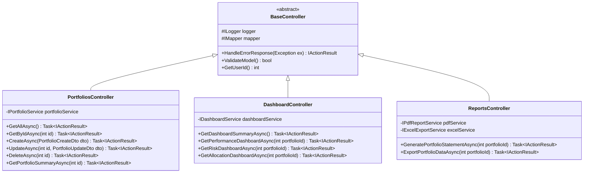

## API Endpoint Mapping

### Core Entity Endpoints

```mermaid
flowchart LR
    subgraph "Portfolio Management"
        P1[GET /api/portfolios]
        P2[GET /api/portfolios/{id}]
        P3[POST /api/portfolios]
        P4[PUT /api/portfolios/{id}]
        P5[DELETE /api/portfolios/{id}]
    end
    
    subgraph "Position Management"
        POS1[GET /api/positions/portfolio/{portfolioId}]
        POS2[GET /api/positions/{id}]
        POS3[POST /api/positions]
        POS4[PUT /api/positions/{id}]
        POS5[DELETE /api/positions/{id}]
    end
    
    subgraph "Transaction Management"
        T1[GET /api/transactions/portfolio/{portfolioId}]
        T2[GET /api/transactions/{id}]
        T3[POST /api/transactions]
        T4[PUT /api/transactions/{id}]
        T5[DELETE /api/transactions/{id}]
    end
    
    subgraph "Security Management"
        S1[GET /api/securities]
        S2[GET /api/securities/{id}]
        S3[POST /api/securities]
        S4[PUT /api/securities/{id}]
        S5[GET /api/securities/search?query=]
    end
```

### Analytics & Reporting Endpoints

```mermaid
flowchart TD
    subgraph "Dashboard Analytics"
        D1[GET /api/dashboard/summary]
        D2[GET /api/dashboard/performance/{portfolioId}]
        D3[GET /api/dashboard/risk/{portfolioId}]
        D4[GET /api/dashboard/allocation/{portfolioId}]
        D5[GET /api/dashboard/transactions/{portfolioId}]
        D6[GET /api/dashboard/multi-portfolio]
    end
    
    subgraph "Report Generation"
        R1[GET /api/reports/pdf/portfolio-statement/{portfolioId}]
        R2[GET /api/reports/pdf/performance/{portfolioId}]
        R3[GET /api/reports/pdf/risk-analysis/{portfolioId}]
        R4[GET /api/reports/excel/portfolio/{portfolioId}]
        R5[GET /api/reports/excel/transactions/{portfolioId}]
    end
    
    subgraph "Performance Analytics"
        PERF1[GET /api/performance/{portfolioId}/metrics]
        PERF2[GET /api/performance/{portfolioId}/history]
        PERF3[GET /api/performance/comparison]
    end
```

## Request/Response Patterns

### Standard CRUD Pattern

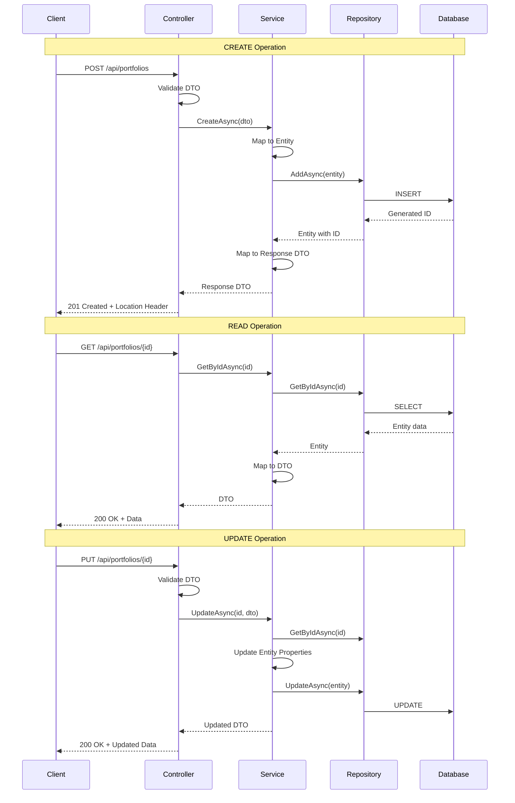

### Error Handling Pattern

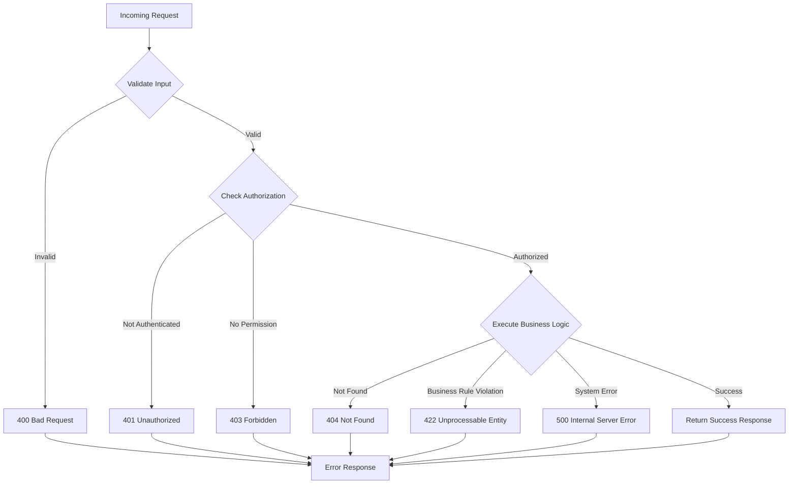

## Data Transfer Objects (DTOs)

### Portfolio DTOs Hierarchy

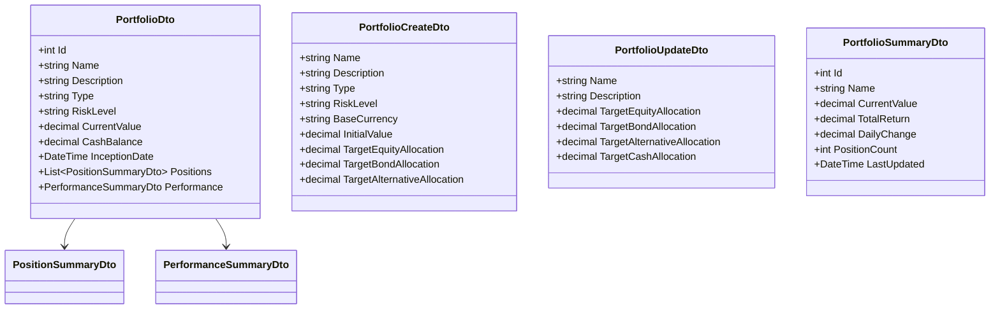

### Response Wrapper Pattern

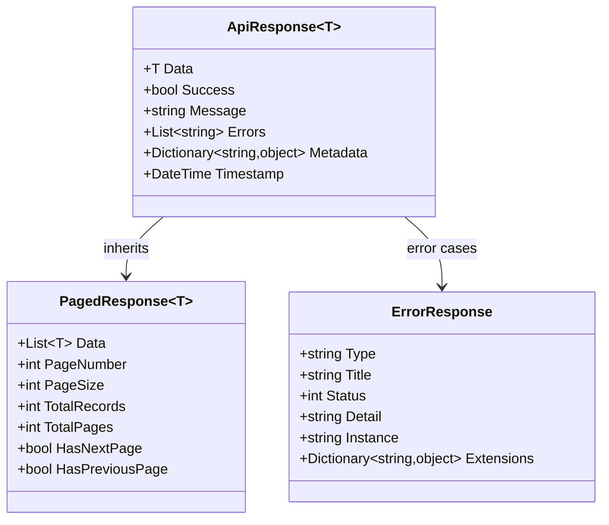

## API Versioning Strategy

```mermaid
graph TD
    subgraph "URL Path Versioning"
        V1[/api/v1/portfolios]
        V2[/api/v2/portfolios]
        V3[/api/v3/portfolios]
    end
    
    subgraph "Header Versioning"
        H1[X-API-Version: 1.0]
        H2[X-API-Version: 2.0]
        H3[Accept: application/vnd.api+json;version=1]
    end
    
    subgraph "Version Management"
        CURRENT[Current Version: v1]
        DEPRECATED[Deprecated Versions]
        SUNSET[Sunset Policy]
    end
    
    V1 --> CURRENT
    V2 --> DEPRECATED
    V3 --> SUNSET
```

## Content Negotiation

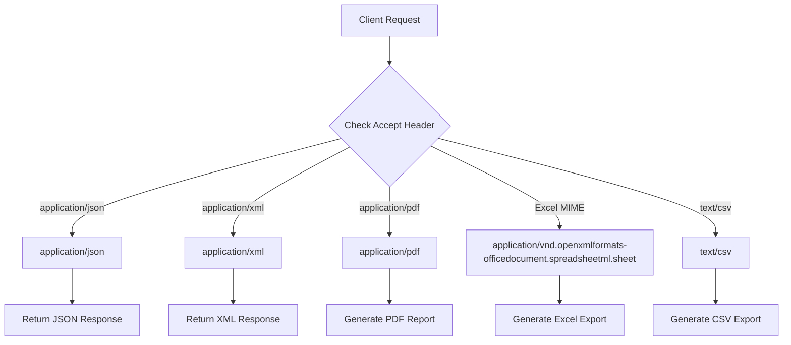

## API Security Implementation

### JWT Token Structure

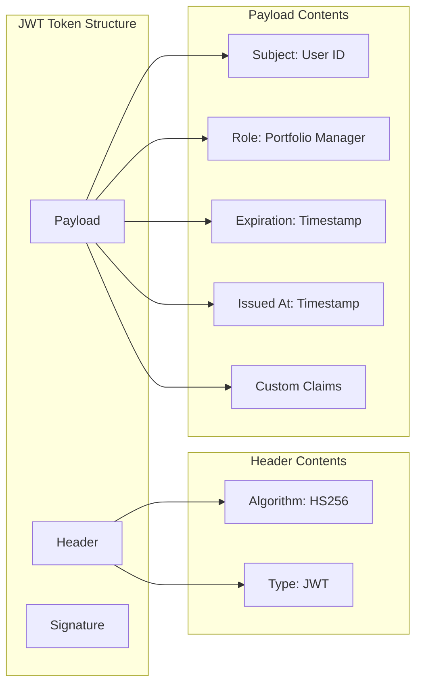

### Rate Limiting Strategy

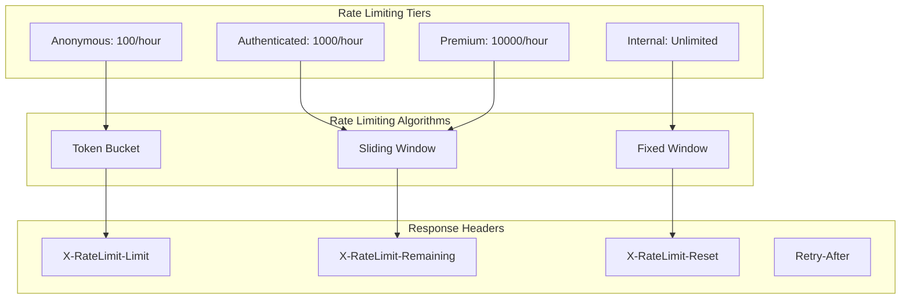

## Performance Optimization

### Caching Strategy

```mermaid
flowchart TD
    REQUEST[API Request]
    CACHE_CHECK{Check Cache}
    CACHE_HIT[Return Cached Data]
    CACHE_MISS[Process Request]
    UPDATE_CACHE[Update Cache]
    RESPONSE[Return Response]
    
    subgraph "Cache Layers"
        MEMORY[In-Memory Cache]
        REDIS[Distributed Cache]
        DATABASE[Database Cache]
    end
    
    subgraph "Cache Keys"
        USER_KEY[user:{id}:portfolios]
        PORTFOLIO_KEY[portfolio:{id}:summary]
        MARKET_KEY[market:prices:{date}]
    end
    
    REQUEST --> CACHE_CHECK
    CACHE_CHECK -->|Hit| CACHE_HIT
    CACHE_CHECK -->|Miss| CACHE_MISS
    CACHE_MISS --> UPDATE_CACHE
    UPDATE_CACHE --> RESPONSE
    CACHE_HIT --> RESPONSE
    
    CACHE_CHECK --> MEMORY
    CACHE_CHECK --> REDIS
    CACHE_CHECK --> DATABASE
```

### Query Optimization

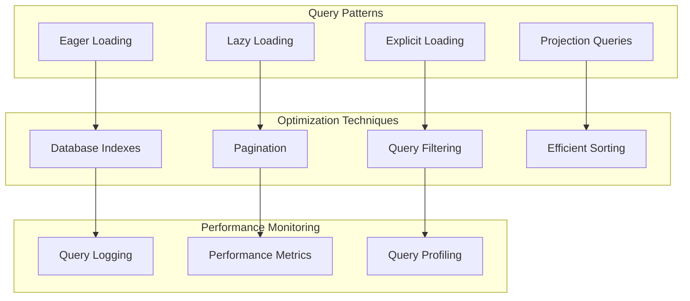

## API Documentation Standards

### OpenAPI/Swagger Configuration

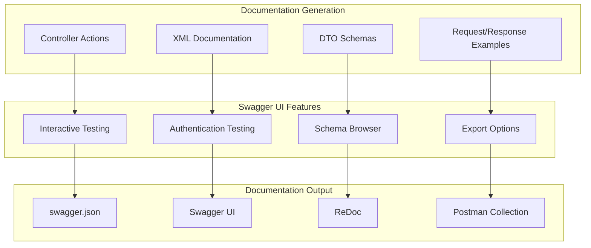

## Comprehensive API Endpoints Reference

### Portfolio Management Endpoints

```http
GET    /api/portfolios                    # List all portfolios
GET    /api/portfolios/{id}               # Get portfolio details
POST   /api/portfolios                    # Create new portfolio
PUT    /api/portfolios/{id}               # Update portfolio
DELETE /api/portfolios/{id}               # Delete portfolio
```

**Portfolio Request/Response Example:**
```json
// POST /api/portfolios - Create Portfolio
{
  "name": "Conservative Growth Fund",
  "description": "Low-risk portfolio for conservative investors",
  "riskLevel": "Conservative",
  "inceptionDate": "2024-01-01",
  "targetEquityAllocation": 0.30,
  "targetBondAllocation": 0.60,
  "targetCashAllocation": 0.10,
  "targetAlternativeAllocation": 0.00
}

// Response 201 Created
{
  "id": 1,
  "name": "Conservative Growth Fund",
  "currentValue": 0.00,
  "totalReturn": 0.00,
  "totalReturnPercentage": 0.00,
  "isActive": true
}
```

### Position Management Endpoints

```http
GET    /api/positions/portfolio/{portfolioId}  # Get portfolio positions
POST   /api/positions                          # Create new position
PUT    /api/positions/{id}                     # Update position
DELETE /api/positions/{id}                     # Delete position
```

### Transaction Processing Endpoints

```http
GET    /api/transactions/portfolio/{portfolioId}  # Get portfolio transactions
POST   /api/transactions                          # Create new transaction
PUT    /api/transactions/{id}                     # Update transaction
DELETE /api/transactions/{id}                     # Delete transaction
```

**Transaction Request Example:**
```json
// POST /api/transactions - Buy Transaction
{
  "portfolioId": 1,
  "securityId": 100,
  "transactionType": "Buy",
  "quantity": 100,
  "price": 25.50,
  "transactionDate": "2024-01-15",
  "notes": "Initial purchase of AAPL"
}
```

### Reporting Endpoints

```http
GET /api/reports/pdf/portfolio-statement/{portfolioId}  # PDF portfolio statement
GET /api/reports/pdf/performance/{portfolioId}          # PDF performance report
GET /api/reports/excel/portfolio/{portfolioId}          # Excel portfolio export
GET /api/reports/excel/transactions/{portfolioId}       # Excel transaction export
```

### Dashboard Analytics Endpoints

```http
GET /api/dashboard/summary                    # Dashboard summary with key metrics
GET /api/dashboard/performance/{portfolioId}  # Performance dashboard
GET /api/dashboard/risk/{portfolioId}         # Risk analysis dashboard
GET /api/dashboard/allocation/{portfolioId}   # Allocation dashboard
GET /api/dashboard/transactions/{portfolioId} # Transaction analytics
GET /api/dashboard/multi-portfolio            # Multi-portfolio comparison
```

**Dashboard Response Example:**
```json
// GET /api/dashboard/summary
{
  "totalPortfolios": 5,
  "totalValue": 10500000.00,
  "totalReturn": 850000.00,
  "totalReturnPercentage": 8.82,
  "topPerformers": [
    {
      "portfolioName": "Growth Fund",
      "returnPercentage": 12.5,
      "value": 2500000.00
    }
  ],
  "recentTransactions": [
    {
      "portfolioName": "Conservative Fund",
      "securitySymbol": "MSFT",
      "transactionType": "Buy",
      "amount": 50000.00,
      "date": "2024-01-15"
    }
  ]
}
```

### Authentication Endpoints

```http
POST /api/auth/login     # User authentication
POST /api/auth/register  # User registration
POST /api/auth/refresh   # Token refresh
```

**Authentication Flow:**
```json
// POST /api/auth/login
{
  "username": "portfolio.manager@cdpq.com",
  "password": "SecurePassword123!"
}

// Response 200 OK
{
  "token": "eyJhbGciOiJIUzI1NiIsInR5cCI6IkpXVCJ9...",
  "user": {
    "id": 1,
    "username": "portfolio.manager@cdpq.com",
    "firstName": "John",
    "lastName": "Doe",
    "role": "PortfolioManager"
  },
  "expires": "2024-01-16T10:00:00Z"
}
```

This API architecture provides:

- **RESTful Design**: Consistent resource-based URLs and HTTP methods
- **Comprehensive Coverage**: Full CRUD operations plus specialized endpoints
- **Security**: JWT authentication with role-based authorization
- **Performance**: Caching, pagination, and query optimization
- **Documentation**: Interactive Swagger/OpenAPI documentation
- **Error Handling**: Consistent error responses with proper HTTP status codes
- **Versioning**: Future-proof API versioning strategy
- **Content Negotiation**: Multiple response formats (JSON, PDF, Excel)