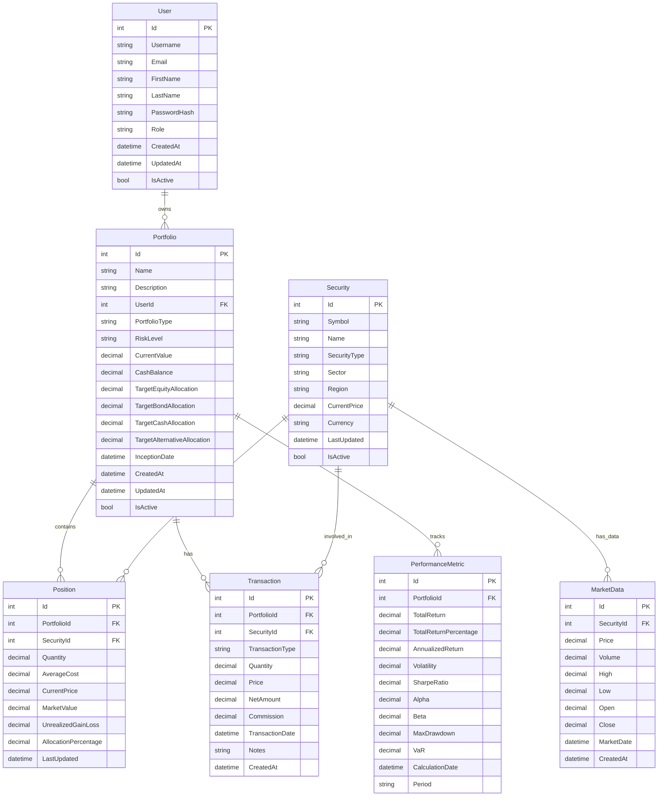
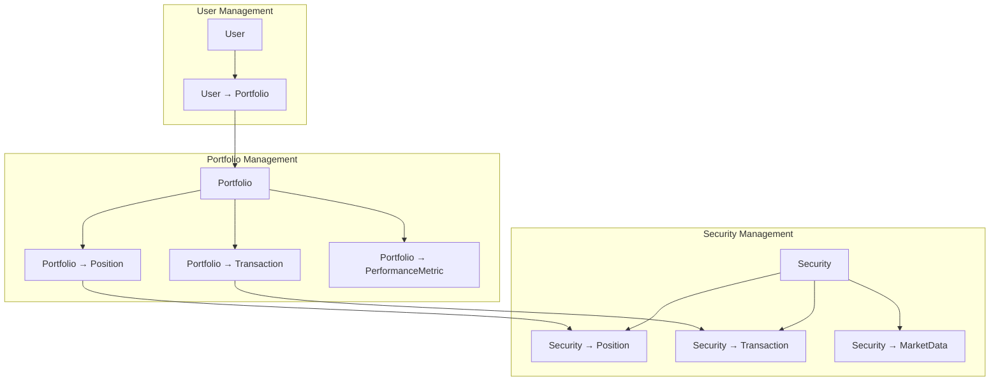

# Database Schema Documentation

## Overview

The Investment Portfolio Management System uses a relational database schema designed to support comprehensive portfolio management for institutional investors. The schema follows domain-driven design principles with clear entity relationships and proper normalization.

## Core Entities

### Entity Relationship Diagram



## Detailed Entity Specifications

### User Entity

The User entity manages system authentication and authorization.

```sql
CREATE TABLE Users (
    Id INT IDENTITY(1,1) PRIMARY KEY,
    Username NVARCHAR(100) NOT NULL UNIQUE,
    Email NVARCHAR(255) NOT NULL UNIQUE,
    FirstName NVARCHAR(100) NOT NULL,
    LastName NVARCHAR(100) NOT NULL,
    PasswordHash NVARCHAR(255) NOT NULL,
    Role NVARCHAR(50) NOT NULL DEFAULT 'User',
    CreatedAt DATETIME2 NOT NULL DEFAULT GETUTCDATE(),
    UpdatedAt DATETIME2 NOT NULL DEFAULT GETUTCDATE(),
    IsActive BIT NOT NULL DEFAULT 1,
    
    INDEX IX_Users_Username (Username),
    INDEX IX_Users_Email (Email),
    INDEX IX_Users_Role (Role)
);
```

**Key Features:**
- **Authentication**: Secure password hashing with salt
- **Authorization**: Role-based access control (User, Manager, Admin)
- **Audit Trail**: Creation and update timestamps
- **Soft Delete**: IsActive flag for logical deletion

### Portfolio Entity

The Portfolio entity represents investment portfolios with target allocations and risk profiles.

```sql
CREATE TABLE Portfolios (
    Id INT IDENTITY(1,1) PRIMARY KEY,
    Name NVARCHAR(200) NOT NULL,
    Description NVARCHAR(1000),
    UserId INT NOT NULL,
    PortfolioType NVARCHAR(50) NOT NULL,
    RiskLevel NVARCHAR(20) NOT NULL,
    CurrentValue DECIMAL(18,2) NOT NULL DEFAULT 0,
    CashBalance DECIMAL(18,2) NOT NULL DEFAULT 0,
    TargetEquityAllocation DECIMAL(5,4) NOT NULL DEFAULT 0,
    TargetBondAllocation DECIMAL(5,4) NOT NULL DEFAULT 0,
    TargetCashAllocation DECIMAL(5,4) NOT NULL DEFAULT 0,
    TargetAlternativeAllocation DECIMAL(5,4) NOT NULL DEFAULT 0,
    InceptionDate DATE NOT NULL,
    CreatedAt DATETIME2 NOT NULL DEFAULT GETUTCDATE(),
    UpdatedAt DATETIME2 NOT NULL DEFAULT GETUTCDATE(),
    IsActive BIT NOT NULL DEFAULT 1,
    
    FOREIGN KEY (UserId) REFERENCES Users(Id),
    INDEX IX_Portfolios_UserId (UserId),
    INDEX IX_Portfolios_RiskLevel (RiskLevel),
    INDEX IX_Portfolios_PortfolioType (PortfolioType),
    INDEX IX_Portfolios_InceptionDate (InceptionDate)
);
```

**Key Features:**
- **Risk Management**: Risk level classification (Conservative, Moderate, Balanced, Growth, Aggressive)
- **Target Allocation**: Percentage targets for different asset classes
- **Portfolio Types**: Various investment strategies and mandates
- **Real-time Valuation**: Current market value calculations

### Security Entity

The Security entity contains information about investment securities.

```sql
CREATE TABLE Securities (
    Id INT IDENTITY(1,1) PRIMARY KEY,
    Symbol NVARCHAR(20) NOT NULL UNIQUE,
    Name NVARCHAR(200) NOT NULL,
    SecurityType NVARCHAR(50) NOT NULL,
    Sector NVARCHAR(100),
    Region NVARCHAR(100),
    CurrentPrice DECIMAL(18,4) NOT NULL DEFAULT 0,
    Currency NVARCHAR(3) NOT NULL DEFAULT 'CAD',
    LastUpdated DATETIME2 NOT NULL DEFAULT GETUTCDATE(),
    IsActive BIT NOT NULL DEFAULT 1,
    
    INDEX IX_Securities_Symbol (Symbol),
    INDEX IX_Securities_SecurityType (SecurityType),
    INDEX IX_Securities_Sector (Sector),
    INDEX IX_Securities_Region (Region)
);
```

**Key Features:**
- **Security Types**: Stocks, Bonds, ETFs, Mutual Funds, REITs, Commodities
- **Geographic Classification**: Regional investment distribution tracking
- **Sector Analysis**: Industry sector categorization
- **Multi-Currency**: Support for different currencies with CAD base

### Position Entity

The Position entity tracks holdings within portfolios.

```sql
CREATE TABLE Positions (
    Id INT IDENTITY(1,1) PRIMARY KEY,
    PortfolioId INT NOT NULL,
    SecurityId INT NOT NULL,
    Quantity DECIMAL(18,6) NOT NULL,
    AverageCost DECIMAL(18,4) NOT NULL,
    CurrentPrice DECIMAL(18,4) NOT NULL DEFAULT 0,
    MarketValue DECIMAL(18,2) NOT NULL DEFAULT 0,
    UnrealizedGainLoss DECIMAL(18,2) NOT NULL DEFAULT 0,
    AllocationPercentage DECIMAL(5,4) NOT NULL DEFAULT 0,
    LastUpdated DATETIME2 NOT NULL DEFAULT GETUTCDATE(),
    
    FOREIGN KEY (PortfolioId) REFERENCES Portfolios(Id) ON DELETE CASCADE,
    FOREIGN KEY (SecurityId) REFERENCES Securities(Id),
    UNIQUE (PortfolioId, SecurityId),
    INDEX IX_Positions_PortfolioId (PortfolioId),
    INDEX IX_Positions_SecurityId (SecurityId),
    INDEX IX_Positions_MarketValue (MarketValue DESC)
);
```

**Key Features:**
- **Cost Basis Tracking**: Average cost calculation for tax purposes
- **Real-time Valuation**: Current market value with price updates
- **Unrealized P&L**: Gain/loss calculations without realization
- **Portfolio Allocation**: Percentage weight within portfolio

### Transaction Entity

The Transaction entity records all portfolio transactions with complete audit trail.

```sql
CREATE TABLE Transactions (
    Id INT IDENTITY(1,1) PRIMARY KEY,
    PortfolioId INT NOT NULL,
    SecurityId INT NOT NULL,
    TransactionType NVARCHAR(20) NOT NULL,
    Quantity DECIMAL(18,6) NOT NULL,
    Price DECIMAL(18,4) NOT NULL,
    NetAmount DECIMAL(18,2) NOT NULL,
    Commission DECIMAL(18,2) NOT NULL DEFAULT 0,
    TransactionDate DATE NOT NULL,
    Notes NVARCHAR(500),
    CreatedAt DATETIME2 NOT NULL DEFAULT GETUTCDATE(),
    
    FOREIGN KEY (PortfolioId) REFERENCES Portfolios(Id),
    FOREIGN KEY (SecurityId) REFERENCES Securities(Id),
    INDEX IX_Transactions_PortfolioId (PortfolioId),
    INDEX IX_Transactions_SecurityId (SecurityId),
    INDEX IX_Transactions_TransactionDate (TransactionDate DESC),
    INDEX IX_Transactions_TransactionType (TransactionType),
    INDEX IX_Transactions_CreatedAt (CreatedAt DESC)
);
```

**Key Features:**
- **Transaction Types**: Buy, Sell, Dividend, Interest, Stock Split, Merger, Transfer
- **Complete Audit Trail**: Immutable transaction records
- **Commission Tracking**: Transaction cost analysis
- **Multi-Portfolio Support**: Transactions across different portfolios

### PerformanceMetric Entity

The PerformanceMetric entity stores calculated performance analytics.

```sql
CREATE TABLE PerformanceMetrics (
    Id INT IDENTITY(1,1) PRIMARY KEY,
    PortfolioId INT NOT NULL,
    TotalReturn DECIMAL(18,2) NOT NULL DEFAULT 0,
    TotalReturnPercentage DECIMAL(8,4) NOT NULL DEFAULT 0,
    AnnualizedReturn DECIMAL(8,4) NOT NULL DEFAULT 0,
    Volatility DECIMAL(8,4) NOT NULL DEFAULT 0,
    SharpeRatio DECIMAL(8,4) NOT NULL DEFAULT 0,
    Alpha DECIMAL(8,4) NOT NULL DEFAULT 0,
    Beta DECIMAL(8,4) NOT NULL DEFAULT 0,
    MaxDrawdown DECIMAL(8,4) NOT NULL DEFAULT 0,
    VaR DECIMAL(8,4) NOT NULL DEFAULT 0,
    CalculationDate DATE NOT NULL,
    Period NVARCHAR(20) NOT NULL,
    
    FOREIGN KEY (PortfolioId) REFERENCES Portfolios(Id) ON DELETE CASCADE,
    INDEX IX_PerformanceMetrics_PortfolioId (PortfolioId),
    INDEX IX_PerformanceMetrics_CalculationDate (CalculationDate DESC),
    INDEX IX_PerformanceMetrics_Period (Period),
    UNIQUE (PortfolioId, CalculationDate, Period)
);
```

**Key Features:**
- **Risk-Adjusted Returns**: Sharpe ratio, alpha, beta calculations
- **Risk Metrics**: Volatility, Value at Risk, maximum drawdown
- **Time Period Analysis**: Daily, weekly, monthly, yearly calculations
- **Historical Tracking**: Performance history over time

### MarketData Entity

The MarketData entity stores historical and current market prices.

```sql
CREATE TABLE MarketData (
    Id INT IDENTITY(1,1) PRIMARY KEY,
    SecurityId INT NOT NULL,
    Price DECIMAL(18,4) NOT NULL,
    Volume BIGINT NOT NULL DEFAULT 0,
    High DECIMAL(18,4) NOT NULL DEFAULT 0,
    Low DECIMAL(18,4) NOT NULL DEFAULT 0,
    Open DECIMAL(18,4) NOT NULL DEFAULT 0,
    Close DECIMAL(18,4) NOT NULL DEFAULT 0,
    MarketDate DATE NOT NULL,
    CreatedAt DATETIME2 NOT NULL DEFAULT GETUTCDATE(),
    
    FOREIGN KEY (SecurityId) REFERENCES Securities(Id),
    INDEX IX_MarketData_SecurityId (SecurityId),
    INDEX IX_MarketData_MarketDate (MarketDate DESC),
    UNIQUE (SecurityId, MarketDate)
);
```

**Key Features:**
- **OHLCV Data**: Complete market data for technical analysis
- **Historical Tracking**: Price history for performance calculations
- **Data Integrity**: Unique constraint preventing duplicate entries
- **Performance Optimization**: Indexed for fast queries

## Entity Relationships

### Primary Relationships



### Relationship Descriptions

#### User → Portfolio (One-to-Many)
- Each user can own multiple portfolios
- Portfolios are owned by exactly one user
- Cascade delete: When user is deleted, all portfolios are deleted

#### Portfolio → Position (One-to-Many)
- Each portfolio can contain multiple positions
- Each position belongs to exactly one portfolio
- Unique constraint: One position per security per portfolio

#### Portfolio → Transaction (One-to-Many)
- Each portfolio can have multiple transactions
- Each transaction belongs to exactly one portfolio
- Immutable: Transactions cannot be deleted, only marked as corrected

#### Security → Position (One-to-Many)
- Each security can be held in multiple portfolios
- Each position references exactly one security
- Market data updates affect all positions of that security

#### Security → MarketData (One-to-Many)
- Each security has historical market data
- Market data entries are unique per security per date
- Used for performance calculations and valuations

## Database Constraints and Business Rules

### Data Integrity Constraints

```sql
-- Portfolio allocation constraints
ALTER TABLE Portfolios 
ADD CONSTRAINT CK_Portfolio_AllocationSum 
CHECK (
    TargetEquityAllocation + TargetBondAllocation + 
    TargetCashAllocation + TargetAlternativeAllocation <= 1.0
);

-- Position quantity constraints
ALTER TABLE Positions
ADD CONSTRAINT CK_Position_QuantityPositive
CHECK (Quantity >= 0);

-- Transaction amount constraints
ALTER TABLE Transactions
ADD CONSTRAINT CK_Transaction_AmountLogic
CHECK (
    (TransactionType IN ('Buy', 'Sell') AND Quantity <> 0) OR
    (TransactionType IN ('Dividend', 'Interest') AND Quantity = 0)
);

-- Performance metric constraints
ALTER TABLE PerformanceMetrics
ADD CONSTRAINT CK_Performance_Volatility
CHECK (Volatility >= 0);
```

### Business Rule Enforcement

#### Portfolio Allocation Rules
- Target allocations must sum to 100% or less
- Risk level must match allocation constraints
- Cash balance cannot be negative
- Portfolio inception date cannot be in the future

#### Position Management Rules
- Position quantity must be non-negative (no short selling)
- Average cost must be positive for equity positions
- Market value is calculated as Quantity × Current Price
- Allocation percentage is calculated as Market Value / Portfolio Value

#### Transaction Processing Rules
- Buy transactions increase position quantity
- Sell transactions decrease position quantity (cannot exceed holdings)
- Dividend transactions increase cash balance
- All transactions must have valid portfolio and security references

## Indexing Strategy

### Performance-Critical Indexes

```sql
-- Portfolio queries (most frequent)
CREATE INDEX IX_Portfolios_UserId_Active ON Portfolios (UserId, IsActive) 
INCLUDE (Name, CurrentValue, RiskLevel);

-- Position lookup by portfolio
CREATE INDEX IX_Positions_PortfolioId_MarketValue ON Positions (PortfolioId, MarketValue DESC)
INCLUDE (SecurityId, Quantity, UnrealizedGainLoss);

-- Transaction history queries
CREATE INDEX IX_Transactions_Portfolio_Date ON Transactions (PortfolioId, TransactionDate DESC)
INCLUDE (SecurityId, TransactionType, NetAmount);

-- Performance metrics time series
CREATE INDEX IX_Performance_Portfolio_Period ON PerformanceMetrics (PortfolioId, Period, CalculationDate DESC)
INCLUDE (TotalReturnPercentage, SharpeRatio, Volatility);

-- Market data lookup
CREATE INDEX IX_MarketData_Security_Date ON MarketData (SecurityId, MarketDate DESC)
INCLUDE (Close, Volume);
```

### Query Optimization Considerations

- **Covering Indexes**: Include frequently accessed columns to avoid key lookups
- **Composite Indexes**: Multi-column indexes for complex WHERE clauses
- **Filtered Indexes**: Indexes on active records only to reduce size
- **Statistics Maintenance**: Automated statistics updates for query optimization

## Data Migration and Versioning

### Entity Framework Core Migrations

The schema is managed through Entity Framework Core migrations, providing:

- **Version Control**: All schema changes are tracked in source control
- **Automated Deployment**: Migrations applied automatically during deployment
- **Rollback Capability**: Down migrations for reverting changes
- **Environment Consistency**: Same schema across all environments

### Migration Best Practices

- **Incremental Changes**: Small, focused migrations for easier troubleshooting
- **Data Preservation**: Careful handling of existing data during schema changes
- **Testing**: All migrations tested in staging environment first
- **Backup Strategy**: Database backups before applying production migrations

This database schema provides a robust foundation for the Investment Portfolio Management System, ensuring data integrity, performance optimization, and scalability for enterprise-level portfolio management operations.