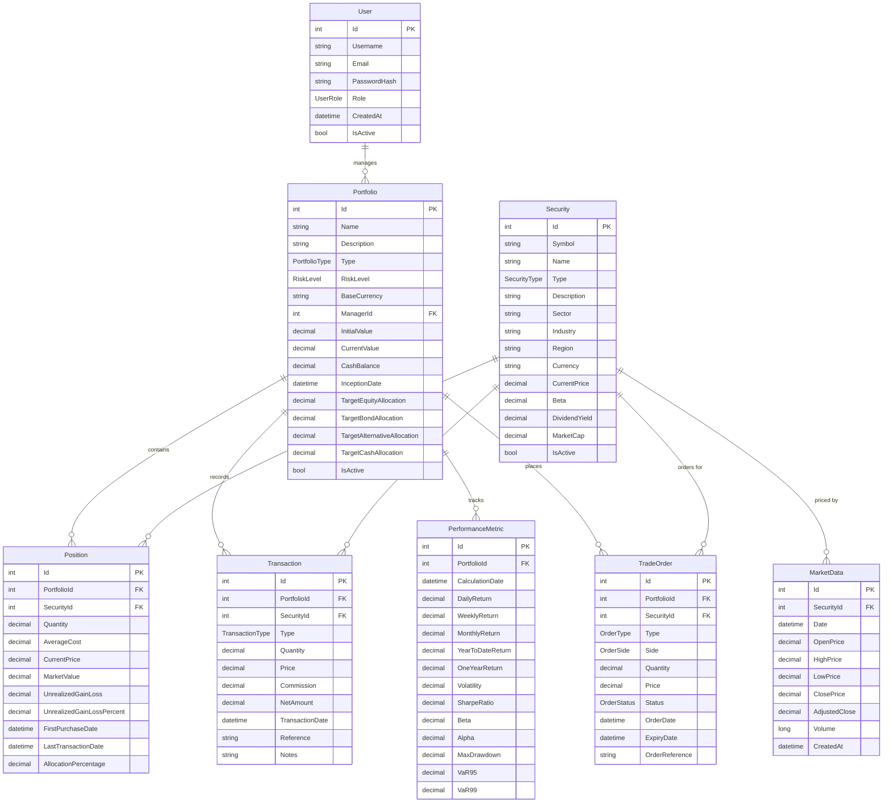
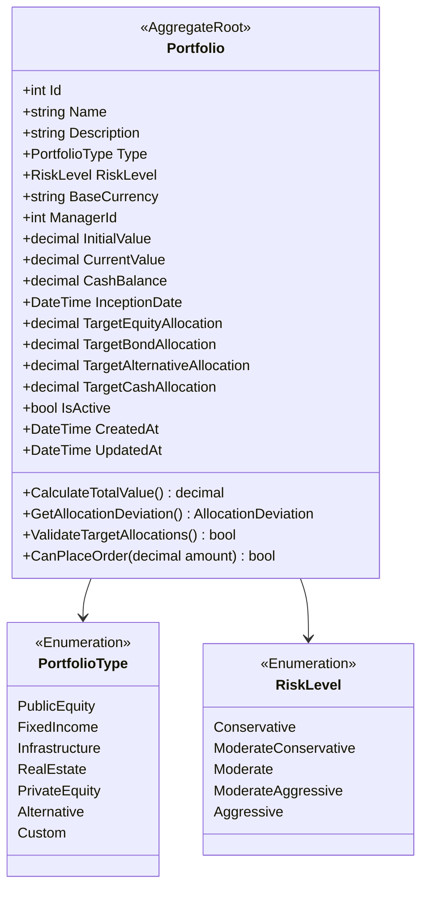
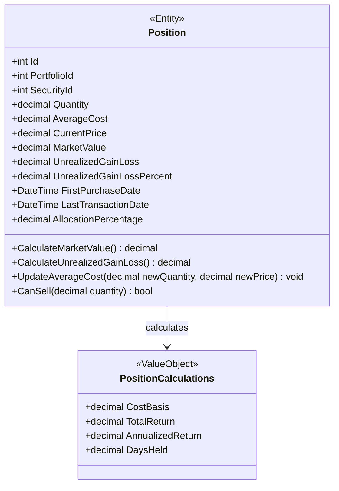
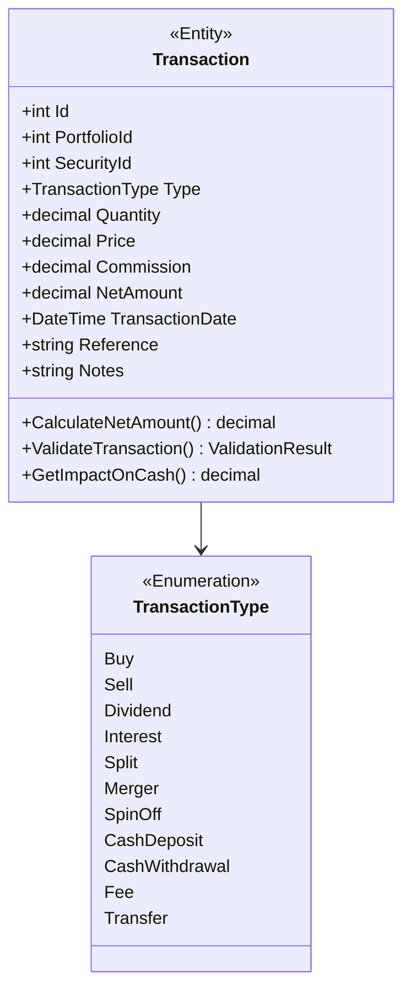
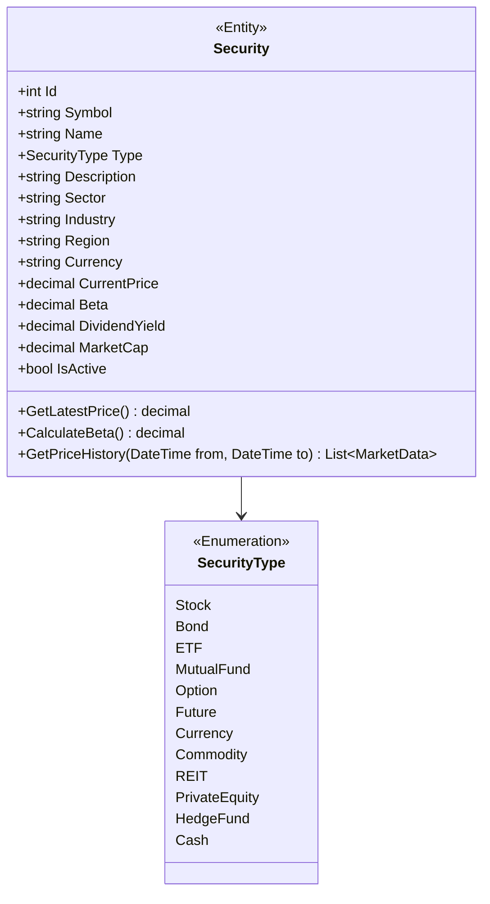
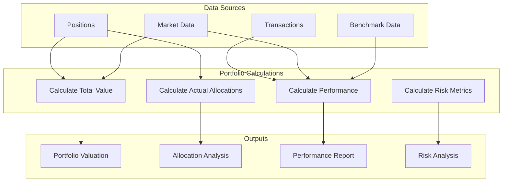
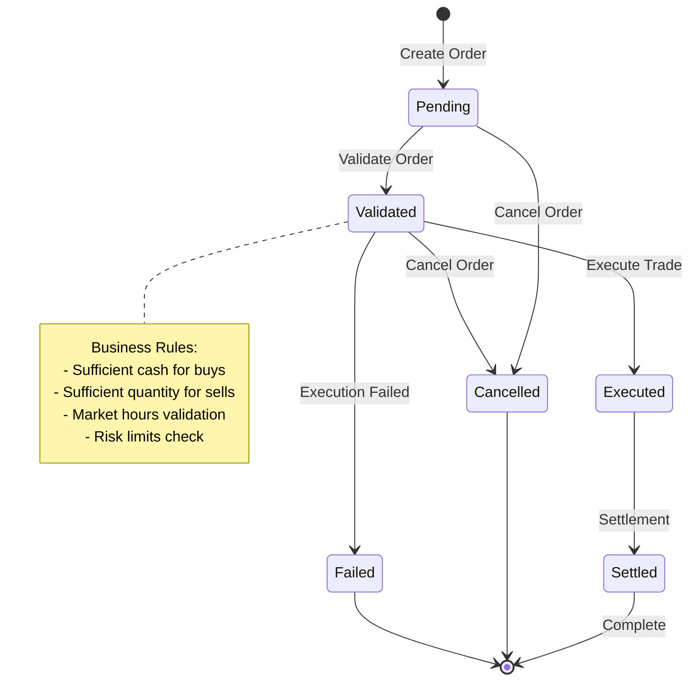
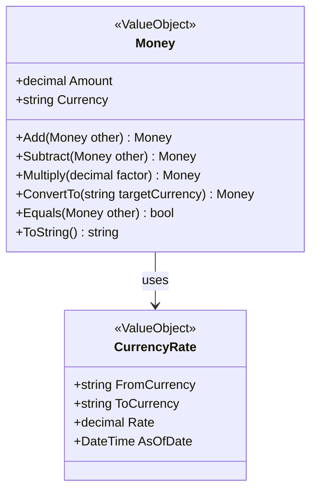
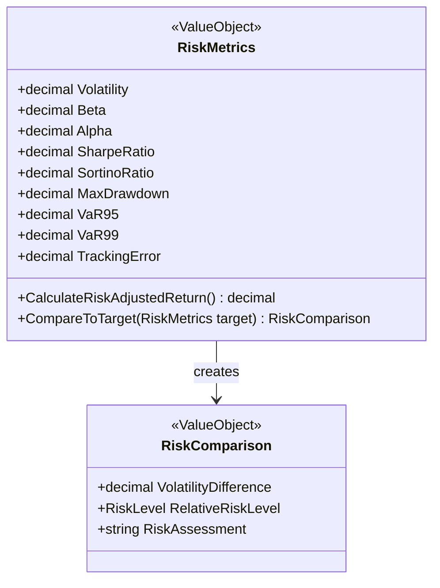
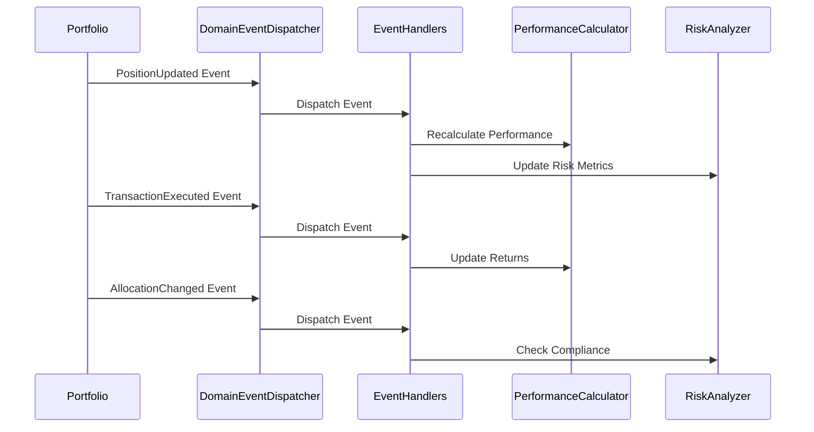

# Domain Model Architecture

## Overview

The domain model represents the core business entities and their relationships in the Investment Portfolio Management System. It follows Domain-Driven Design (DDD) principles with rich domain entities, value objects, and business rules.

## Entity Relationship Diagram



## Domain Entities Deep Dive

### Portfolio Entity

The Portfolio is the central aggregate root representing an investment portfolio.



**Business Rules:**
- Total target allocations must equal 100%
- Current value cannot be negative
- Cash balance can be negative (leverage scenarios)
- Portfolio must have a valid manager

### Position Entity

Represents a holding of a specific security within a portfolio.



**Business Rules:**
- Quantity must be positive for long positions
- Average cost must be positive
- Market value is calculated as Quantity × Current Price
- Unrealized gain/loss = Market Value - (Quantity × Average Cost)

### Transaction Entity

Records all portfolio transactions with full audit trail.



**Business Rules:**
- Buy transactions decrease cash balance
- Sell transactions increase cash balance
- Dividend and interest transactions increase cash balance
- Commission is always positive
- Net amount calculation varies by transaction type

### Security Entity

Represents tradeable financial instruments.



## Domain Services

### Portfolio Aggregation Service



### Transaction Processing Domain Service



## Value Objects

### Money Value Object



### Risk Metrics Value Object



## Domain Events

### Portfolio Events



## Aggregates and Consistency Boundaries

```mermaid
graph TB
    subgraph "Portfolio Aggregate"
        PORT[Portfolio Root]
        POS[Positions]
        TRANS[Transactions]
        PERF[Performance Metrics]
        ORDERS[Trade Orders]
    end
    
    subgraph "Security Aggregate"
        SEC[Security Root]
        MARKET[Market Data]
        CORP[Corporate Actions]
    end
    
    subgraph "User Aggregate"
        USER[User Root]
        PREF[Preferences]
        ROLE[Roles & Permissions]
    end
    
    PORT --> POS
    PORT --> TRANS
    PORT --> PERF
    PORT --> ORDERS
    
    SEC --> MARKET
    SEC --> CORP
    
    USER --> PREF
    USER --> ROLE
    
    PORT -.-> SEC : references
    USER -.-> PORT : manages
```

**Consistency Rules:**
- All changes within an aggregate are atomic
- Cross-aggregate operations use eventual consistency
- Domain events ensure consistency across aggregates
- Business rules are enforced at aggregate boundaries

## Business Rules Matrix

| Entity | Business Rule | Validation | Constraint |
|--------|---------------|------------|------------|
| Portfolio | Target allocations = 100% | Sum validation | Database constraint |
| Position | Quantity > 0 for holdings | Domain validation | Check constraint |
| Transaction | Sufficient cash for buys | Business service | Application logic |
| Security | Unique symbol per exchange | Domain validation | Unique index |
| User | Unique email address | Domain validation | Unique constraint |
| MarketData | No future dates | Domain validation | Check constraint |

This domain model provides:

- **Rich Behavior**: Entities contain business logic, not just data
- **Consistency**: Business rules are enforced at appropriate boundaries  
- **Immutability**: Value objects are immutable for thread safety
- **Events**: Domain events enable loose coupling between aggregates
- **Validation**: Multi-layered validation from domain to database
- **Encapsulation**: Internal state is protected through proper encapsulation