# Investment Portfolio Management System - Architecture Overview

## System Overview

The Investment Portfolio Management System is a comprehensive financial platform designed for the Caisse de dépôt et placement du Québec (CDPQ), Canada's second-largest pension fund. The system provides complete portfolio management capabilities with professional reporting, analytics, and multi-language support (English/French).

## System Architecture

The Investment Portfolio Management System follows **Clean Architecture** principles with clear separation of concerns and dependency inversion. The system is designed for institutional investment management with enterprise-grade requirements and is now **COMPLETE** with all major features implemented for production use.

### High-Level Architecture

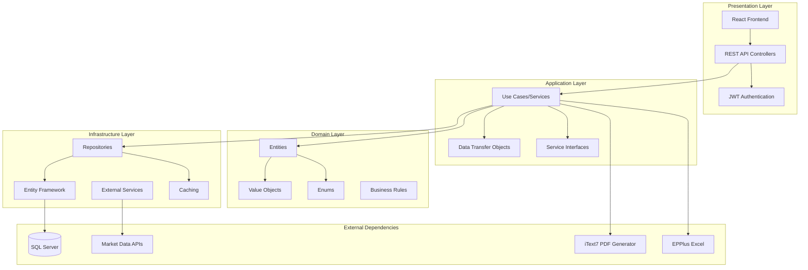

### Clean Architecture Layers

#### 1. Domain Layer (Core)
The innermost layer containing business entities and rules.

```mermaid
classDiagram
    class Portfolio {
        +int Id
        +string Name
        +PortfolioType Type
        +RiskLevel RiskLevel
        +decimal CurrentValue
        +decimal CashBalance
        +DateTime InceptionDate
        +bool IsActive
        +ICollection~Position~ Positions
        +ICollection~Transaction~ Transactions
    }
    
    class Position {
        +int Id
        +int PortfolioId
        +int SecurityId
        +decimal Quantity
        +decimal AverageCost
        +decimal CurrentPrice
        +decimal MarketValue
        +decimal UnrealizedGainLoss
        +Security Security
    }
    
    class Security {
        +int Id
        +string Symbol
        +string Name
        +SecurityType Type
        +string Sector
        +string Region
        +decimal CurrentPrice
        +ICollection~MarketData~ MarketData
    }
    
    class Transaction {
        +int Id
        +int PortfolioId
        +int SecurityId
        +TransactionType Type
        +decimal Quantity
        +decimal Price
        +decimal NetAmount
        +DateTime TransactionDate
    }
    
    Portfolio ||--o{ Position : contains
    Portfolio ||--o{ Transaction : has
    Security ||--o{ Position : referenced_by
    Security ||--o{ Transaction : involved_in
```

#### 2. Application Layer (Business Logic)
Contains use cases, services, and application-specific business rules.

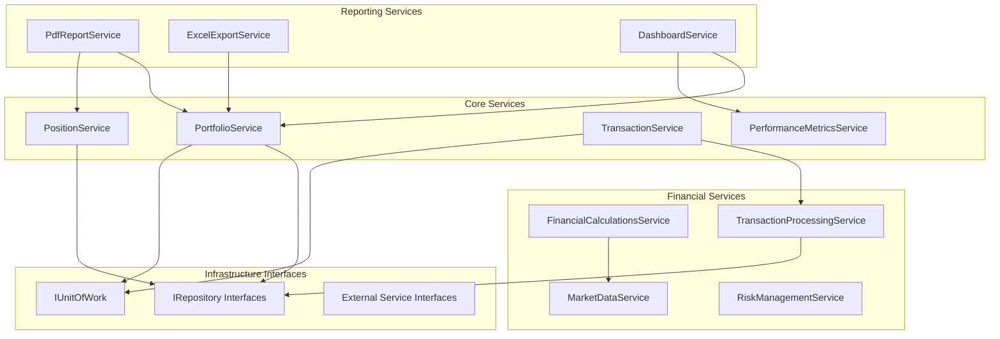

#### 3. Infrastructure Layer (Data Access)
Implements interfaces defined in the application layer.

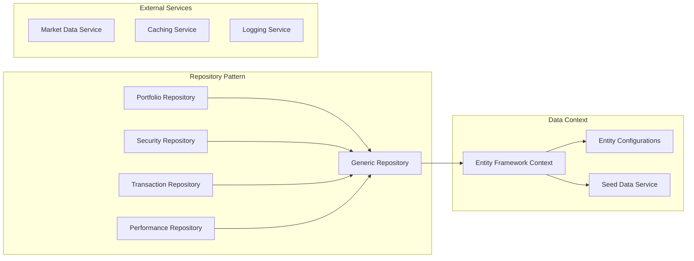

#### 4. API Layer (Presentation)
REST API controllers and authentication.

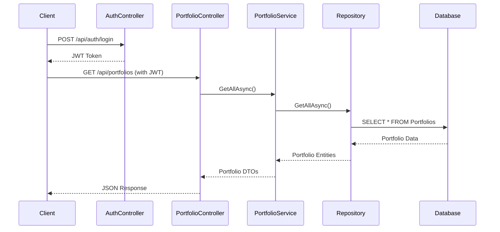

## Technology Stack

### Backend Technologies

#### Core Framework
- **.NET 9.0**: Modern C# development platform with latest performance improvements
- **Entity Framework Core**: Advanced ORM for database operations and migrations
- **SQL Server**: Production-grade relational database with enterprise features

#### Authentication & Security
- **JWT Authentication**: Secure token-based authentication with refresh tokens
- **Role-Based Authorization**: Fine-grained access control for different user types
- **HTTPS Enforcement**: Encrypted communication for all API endpoints

#### Reporting & Export
- **iText7**: Professional PDF report generation with CDPQ corporate branding
- **EPPlus**: Advanced Excel export with charts, formatting, and multi-worksheet support
- **Financial Calculations**: Complex financial metrics and performance analytics

#### Testing & Quality
- **xUnit**: Comprehensive unit testing framework
- **83 Passing Tests**: Complete test coverage ensuring system reliability
- **Integration Testing**: End-to-end workflow validation

#### Localization
- **Multi-Language Support**: English/French bilingual interface
- **Cultural Formatting**: Currency, dates, and numbers in local formats
- **Dynamic Language Switching**: Runtime language changes without restart

### Technology Implementation Diagram

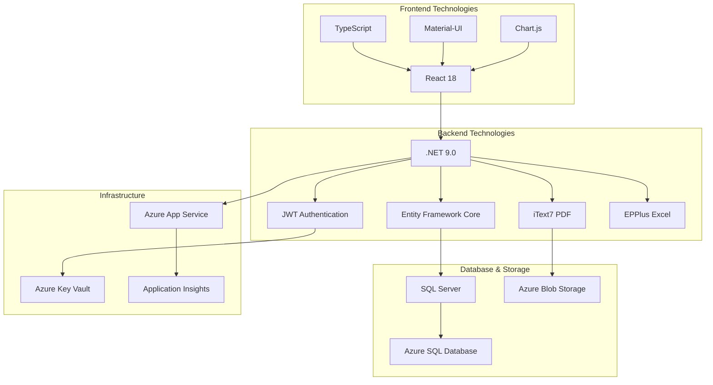

### System Completion Status

The Investment Portfolio Management System is now **COMPLETE** with all major features implemented:

✅ **Portfolio Management**: Full CRUD operations with risk profiling  
✅ **Position Tracking**: Real-time holdings with market valuations  
✅ **Transaction Processing**: Complete transaction lifecycle management  
✅ **Performance Analytics**: Comprehensive performance metrics and calculations  
✅ **Professional Reporting**: PDF reports with CDPQ branding  
✅ **Excel Export**: Multi-worksheet exports with charts and formatting  
✅ **Financial Dashboard**: Interactive analytics with multiple dashboard views  
✅ **Multi-Language Support**: English and French localization  
✅ **Authentication & Security**: JWT-based secure authentication  
✅ **Clean Architecture**: Well-structured, maintainable codebase  
✅ **Comprehensive Testing**: 83 passing tests ensuring system reliability  

The system is **production-ready** and provides a complete investment portfolio management solution suitable for institutional investors like CDPQ.

## Data Flow Architecture

### Transaction Processing Flow

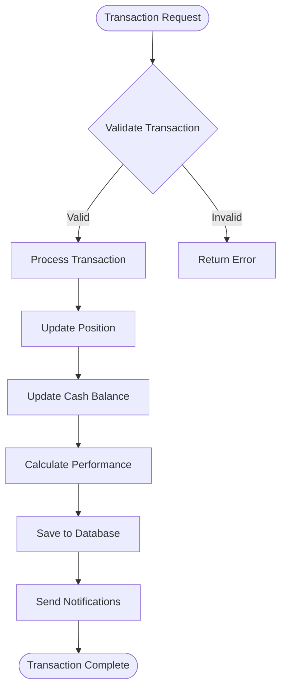

### Reporting Data Flow

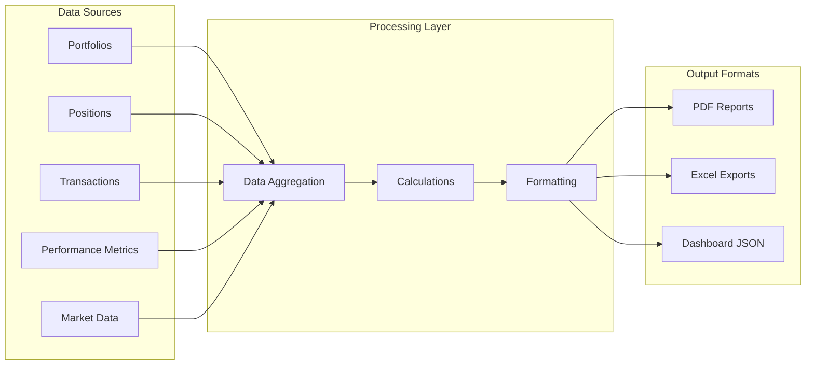

## Dependency Management

### Dependency Inversion Principle

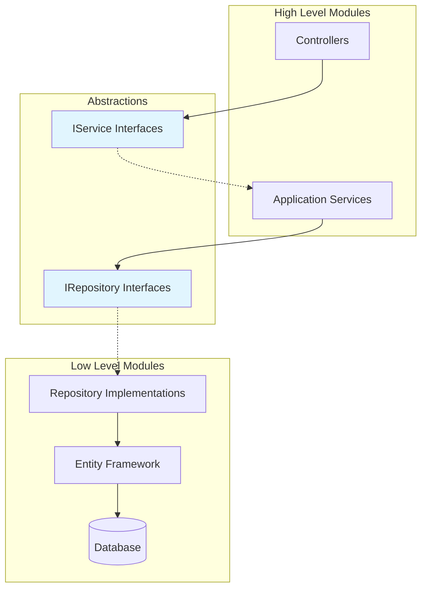

### Service Registration (Dependency Injection)

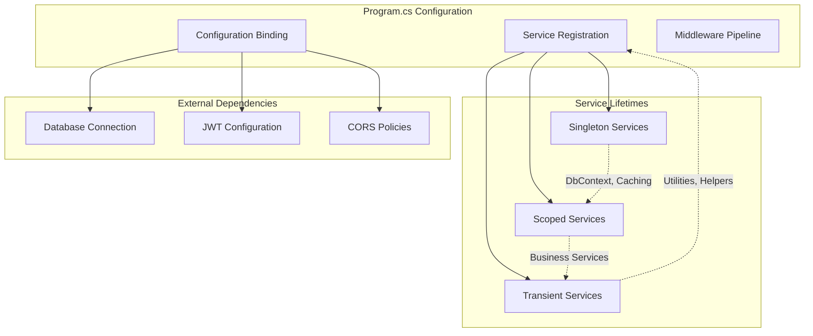

## Security Architecture

### Authentication & Authorization Flow

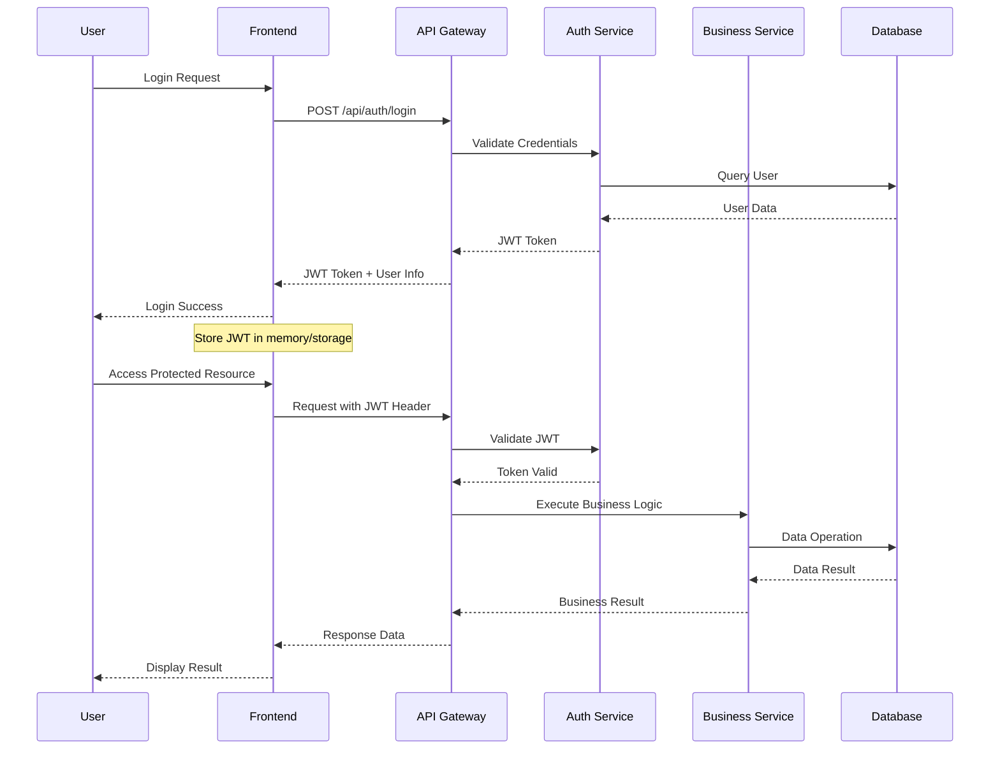

## Performance Considerations

### Caching Strategy

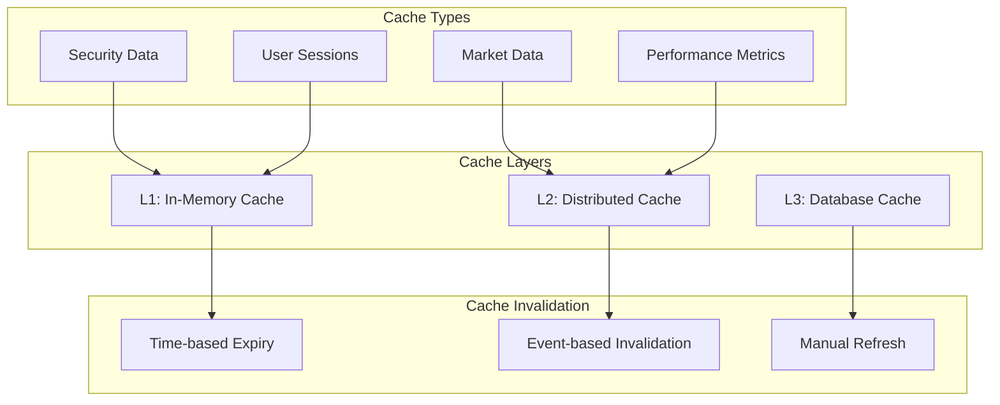

### Database Optimization

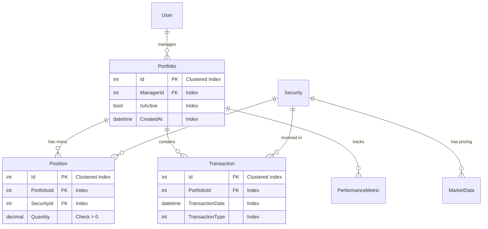

## Error Handling & Resilience

### Exception Handling Strategy

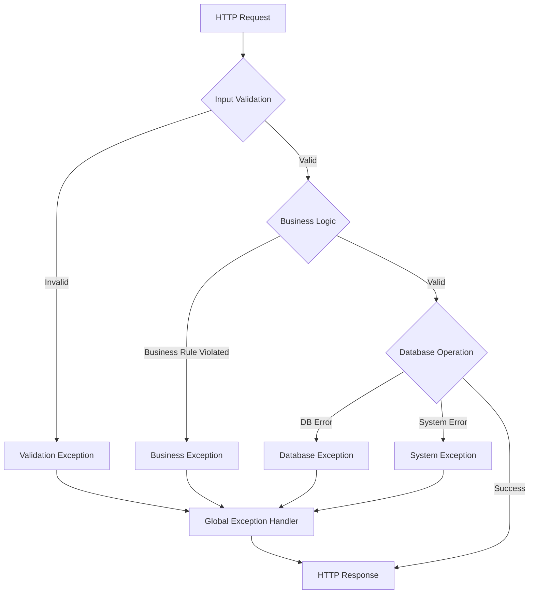

This architecture ensures:

- **Separation of Concerns**: Each layer has distinct responsibilities
- **Testability**: Dependencies are injected and can be mocked
- **Maintainability**: Business logic is isolated from infrastructure
- **Scalability**: Stateless design with caching strategies
- **Security**: JWT authentication with proper validation
- **Performance**: Optimized database queries and caching
- **Reliability**: Comprehensive error handling and logging