# Deployment Architecture

## Overview

The Investment Portfolio Management System is designed for cloud-native deployment with support for various hosting environments including Azure, AWS, and on-premises infrastructure. The deployment architecture emphasizes scalability, reliability, and security.

## Deployment Topology

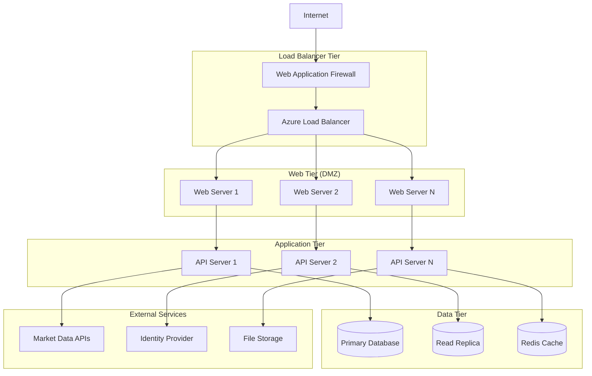

## Container Architecture

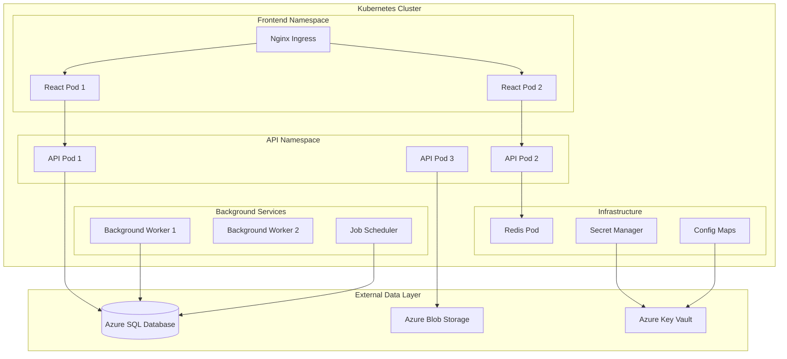

## Development to Production Pipeline

```mermaid
flowchart LR
    subgraph "Development"
        DEV_CODE[Source Code]
        DEV_BUILD[Local Build]
        DEV_TEST[Unit Tests]
    end
    
    subgraph "Continuous Integration"
        CI_TRIGGER[Git Push]
        CI_BUILD[Build Pipeline]
        CI_TEST[Automated Tests]
        CI_SECURITY[Security Scan]
        CI_ARTIFACT[Build Artifacts]
    end
    
    subgraph "Staging Environment"
        STAGE_DEPLOY[Staging Deployment]
        STAGE_TEST[Integration Tests]
        STAGE_PERF[Performance Tests]
        STAGE_APPROVAL[Manual Approval]
    end
    
    subgraph "Production Environment"
        PROD_DEPLOY[Blue-Green Deployment]
        PROD_MONITOR[Health Monitoring]
        PROD_ROLLBACK[Rollback Strategy]
    end
    
    DEV_CODE --> DEV_BUILD --> DEV_TEST
    DEV_TEST --> CI_TRIGGER
    CI_TRIGGER --> CI_BUILD --> CI_TEST --> CI_SECURITY --> CI_ARTIFACT
    CI_ARTIFACT --> STAGE_DEPLOY --> STAGE_TEST --> STAGE_PERF --> STAGE_APPROVAL
    STAGE_APPROVAL --> PROD_DEPLOY --> PROD_MONITOR
    PROD_MONITOR --> PROD_ROLLBACK
```

## Environment Configuration

### Development Environment

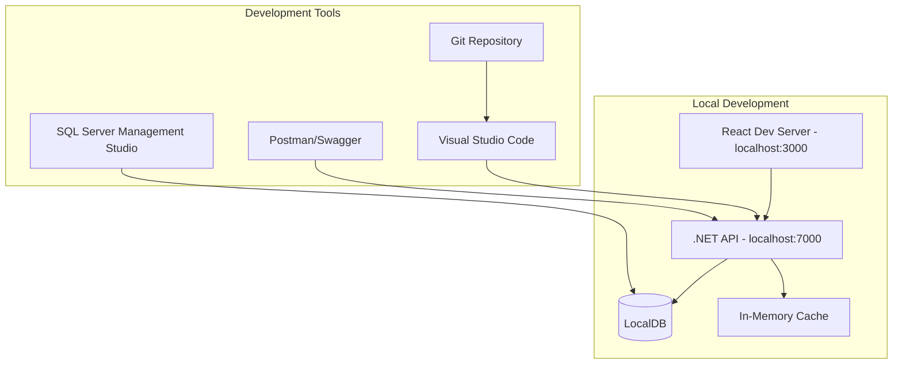

### Production Environment

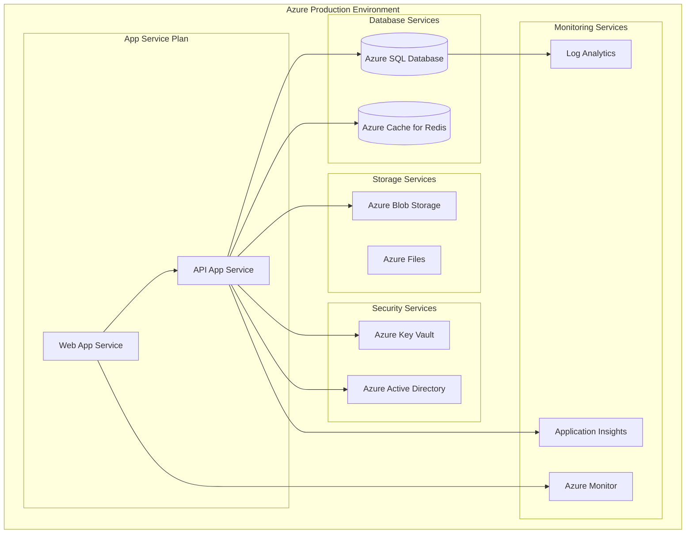

## Infrastructure as Code

### Terraform Configuration Structure

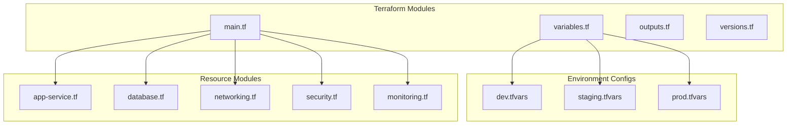

### ARM Template Structure

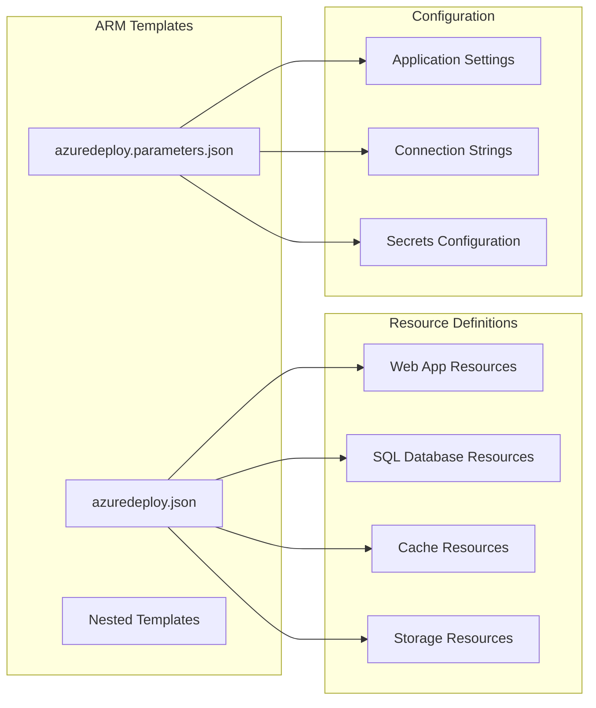

## Database Deployment Strategy

### Database Migration Pipeline

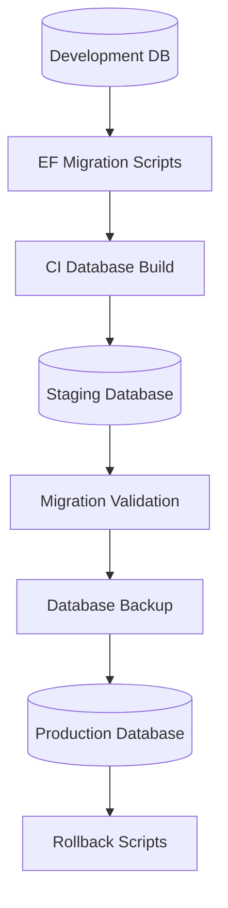

### Database High Availability

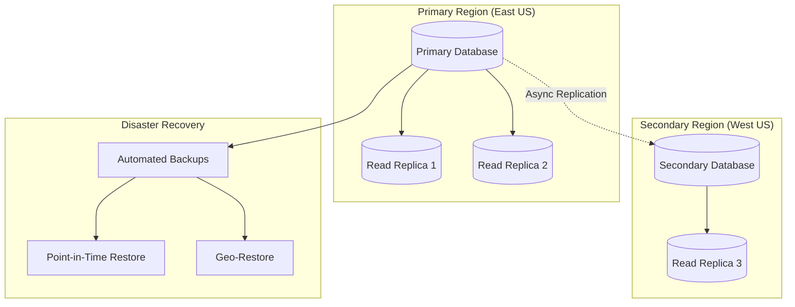

## Security Architecture

### Network Security

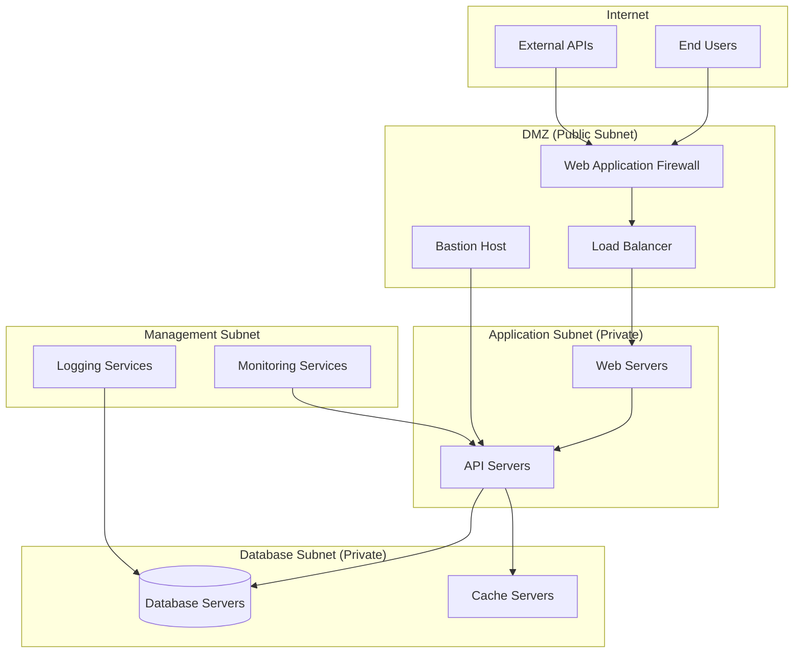

### Identity and Access Management

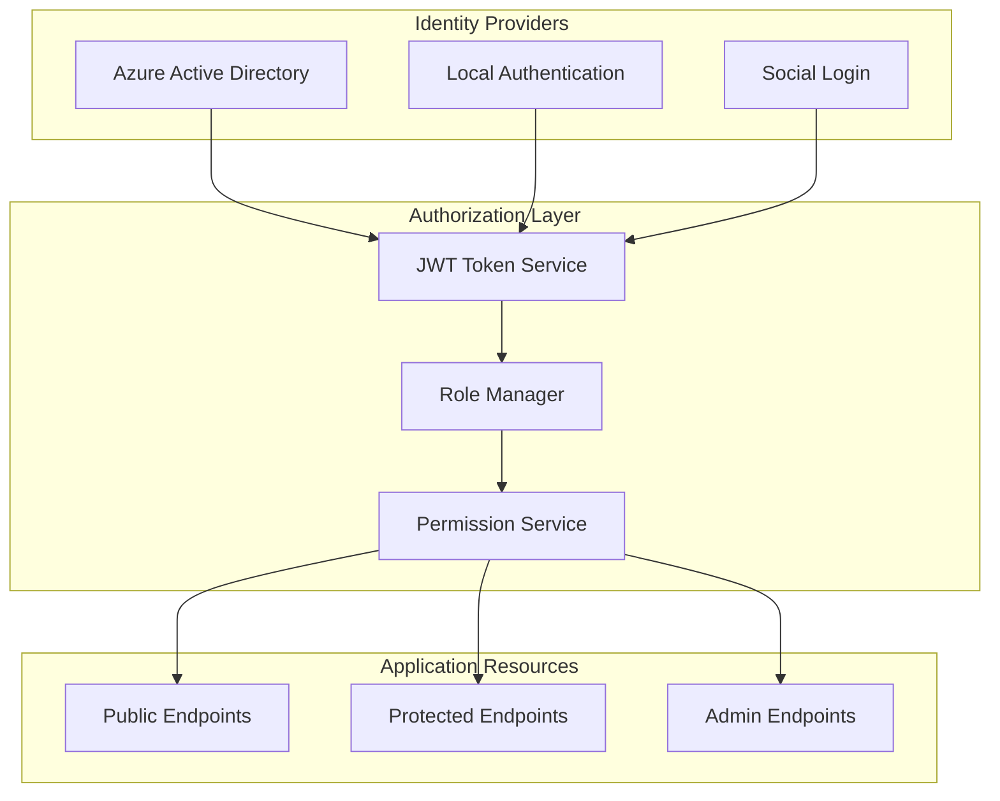

## Monitoring and Observability

### Application Performance Monitoring

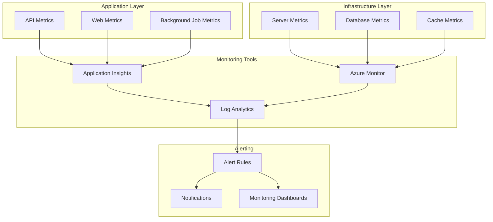

### Logging Architecture

```mermaid
flowchart LR
    subgraph "Application Logs"
        API_LOGS[API Request Logs]
        ERROR_LOGS[Error Logs]
        AUDIT_LOGS[Audit Logs]
        PERFORMANCE_LOGS[Performance Logs]
    end
    
    subgraph "Log Aggregation"
        STRUCTURED_LOGGING[Structured Logging]
        LOG_CORRELATION[Correlation IDs]
        LOG_ENRICHMENT[Context Enrichment]
    end
    
    subgraph "Log Storage"
        LOG_ANALYTICS_WS[Log Analytics Workspace]
        BLOB_STORAGE_LOGS[Blob Storage Archive]
        ELASTIC_SEARCH[Elasticsearch (Optional)]
    end
    
    subgraph "Log Analysis"
        KUSTO_QUERIES[Kusto Queries]
        LOG_DASHBOARDS[Log Dashboards]
        ANOMALY_DETECTION[Anomaly Detection]
    end
    
    API_LOGS --> STRUCTURED_LOGGING
    ERROR_LOGS --> LOG_CORRELATION
    AUDIT_LOGS --> LOG_ENRICHMENT
    PERFORMANCE_LOGS --> STRUCTURED_LOGGING
    
    STRUCTURED_LOGGING --> LOG_ANALYTICS_WS
    LOG_CORRELATION --> BLOB_STORAGE_LOGS
    LOG_ENRICHMENT --> ELASTIC_SEARCH
    
    LOG_ANALYTICS_WS --> KUSTO_QUERIES
    BLOB_STORAGE_LOGS --> LOG_DASHBOARDS
    ELASTIC_SEARCH --> ANOMALY_DETECTION
```

## Scaling Strategy

### Horizontal Scaling

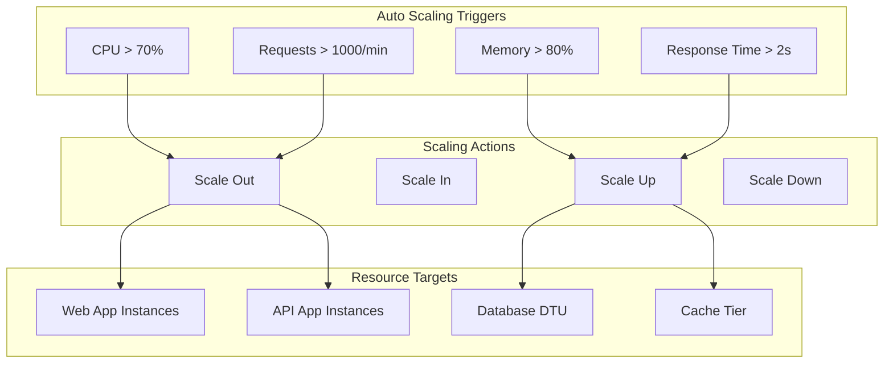

### Database Scaling Strategy

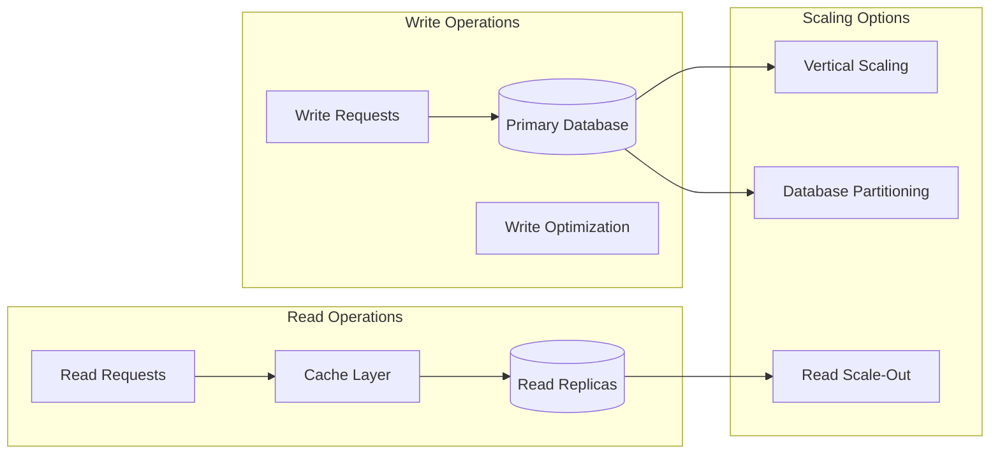

## Disaster Recovery Plan

### Backup Strategy

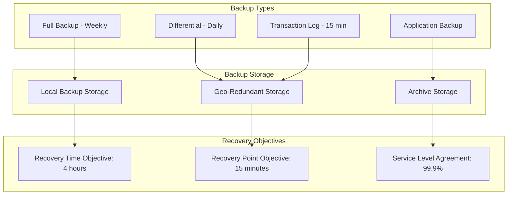

### Disaster Recovery Procedures

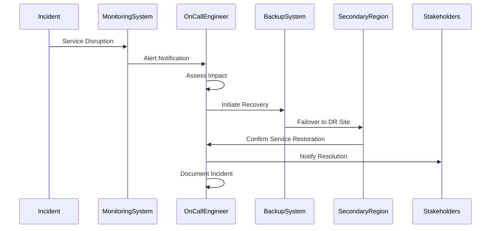

## Specific Deployment Considerations for CDPQ

### Environment Configuration Details

#### Development Environment
- **Local SQL Server**: LocalDB for local development with comprehensive seed data
- **In-Memory Services**: Lightweight services for rapid development cycles
- **Hot Reload**: Live code updates during development
- **Debug Configurations**: Comprehensive debugging support with detailed logging

#### Testing Environment
- **In-Memory Database**: Fast test execution with Entity Framework Core InMemory provider
- **Isolated Testing**: Clean database state for each test run
- **Mock Services**: External service mocking for reliable testing
- **Automated Test Data**: Comprehensive test data generation and cleanup

#### Production Environment
- **Azure SQL Database**: Enterprise-grade database with backup and recovery
- **High Availability**: 99.99% uptime SLA with automatic failover
- **Performance Monitoring**: Real-time performance tracking and optimization
- **Compliance**: CDPQ regulatory compliance and audit requirements

### Security Features Implementation

#### JWT Token Authentication
- **Secure API Access**: Industry-standard JWT tokens with RS256 signing
- **Token Refresh**: Automatic token renewal without user re-authentication
- **Role-Based Authorization**: Fine-grained permissions for different user roles
- **Session Management**: Secure session handling with automatic timeout

#### HTTPS Enforcement
- **Encrypted Communication**: All API communication over HTTPS
- **Certificate Management**: Automated SSL certificate provisioning and renewal
- **HSTS Headers**: HTTP Strict Transport Security for enhanced protection
- **Secure Cookie Handling**: HttpOnly and Secure flags for all cookies

#### Input Validation & Protection
- **Comprehensive Data Validation**: Server-side validation for all input data
- **SQL Injection Prevention**: Parameterized queries via Entity Framework Core
- **XSS Protection**: Cross-site scripting prevention with output encoding
- **CSRF Protection**: Anti-forgery tokens for all state-changing operations

### Performance Optimizations

#### Database Indexing Strategy
- **Optimized Query Performance**: Strategic indexing on frequently queried columns
- **Composite Indexes**: Multi-column indexes for complex query patterns
- **Covering Indexes**: Include columns for query performance optimization
- **Index Maintenance**: Automated index optimization and fragmentation management

#### Caching Strategy
- **Application-Level Caching**: In-memory caching for frequently accessed data
- **Distributed Caching**: Redis for scalable caching across multiple instances
- **Cache Invalidation**: Smart cache invalidation strategies for data consistency
- **Cache Warming**: Proactive cache population for critical data

#### Async Operations
- **Non-Blocking Database Operations**: Async/await patterns throughout the application
- **Concurrent Processing**: Parallel processing for batch operations
- **Background Tasks**: Asynchronous processing for long-running operations
- **Resource Management**: Efficient connection pooling and resource disposal

#### Connection Pooling
- **Efficient Database Connections**: Connection pooling for optimal resource utilization
- **Connection String Optimization**: Optimized connection parameters for performance
- **Connection Monitoring**: Real-time monitoring of connection pool health
- **Automatic Recovery**: Connection retry logic with exponential backoff

### Production Deployment Checklist

#### Pre-Deployment Validation
- ✅ **All Tests Passing**: 83 comprehensive unit and integration tests
- ✅ **Security Scanning**: No critical vulnerabilities detected
- ✅ **Performance Benchmarks**: All performance metrics within acceptable ranges
- ✅ **Configuration Validation**: Environment-specific configurations validated
- ✅ **Database Migration**: All EF Core migrations applied successfully

#### Deployment Process
- ✅ **Blue-Green Deployment**: Zero-downtime deployment strategy
- ✅ **Health Checks**: Comprehensive application health monitoring
- ✅ **Rollback Procedures**: Automated rollback capability in case of issues
- ✅ **Monitoring Setup**: Real-time monitoring and alerting configuration
- ✅ **Load Balancer Configuration**: Traffic distribution and health checks

#### Post-Deployment Verification
- ✅ **Smoke Tests**: Critical functionality verification
- ✅ **Performance Monitoring**: Response time and throughput validation
- ✅ **Security Validation**: Authentication and authorization testing
- ✅ **Integration Testing**: External service connectivity verification
- ✅ **User Acceptance**: End-user functionality validation

### CDPQ-Specific Requirements

#### Regulatory Compliance
- **Financial Regulations**: Compliance with Canadian financial regulations
- **Data Residency**: Data storage within Canadian jurisdiction
- **Audit Trail**: Comprehensive audit logging for regulatory reporting
- **Data Retention**: Configurable data retention policies for compliance

#### Institutional Features
- **Multi-Language Support**: English and French localization for Canadian requirements
- **Professional Reporting**: CDPQ-branded PDF reports with corporate standards
- **Enterprise Authentication**: Integration with existing CDPQ identity systems
- **High-Volume Processing**: Optimized for institutional-scale portfolio management

This deployment architecture ensures:

- **High Availability**: Multi-region deployment with automatic failover
- **Scalability**: Auto-scaling based on demand and performance metrics
- **Security**: Defense-in-depth with network segmentation and identity management
- **Monitoring**: Comprehensive observability with proactive alerting
- **Disaster Recovery**: Robust backup and recovery procedures
- **Infrastructure as Code**: Repeatable, version-controlled infrastructure deployment
- **CI/CD Pipeline**: Automated testing and deployment with quality gates
- **CDPQ Compliance**: Full compliance with institutional and regulatory requirements
- **Production Readiness**: Complete implementation ready for enterprise deployment