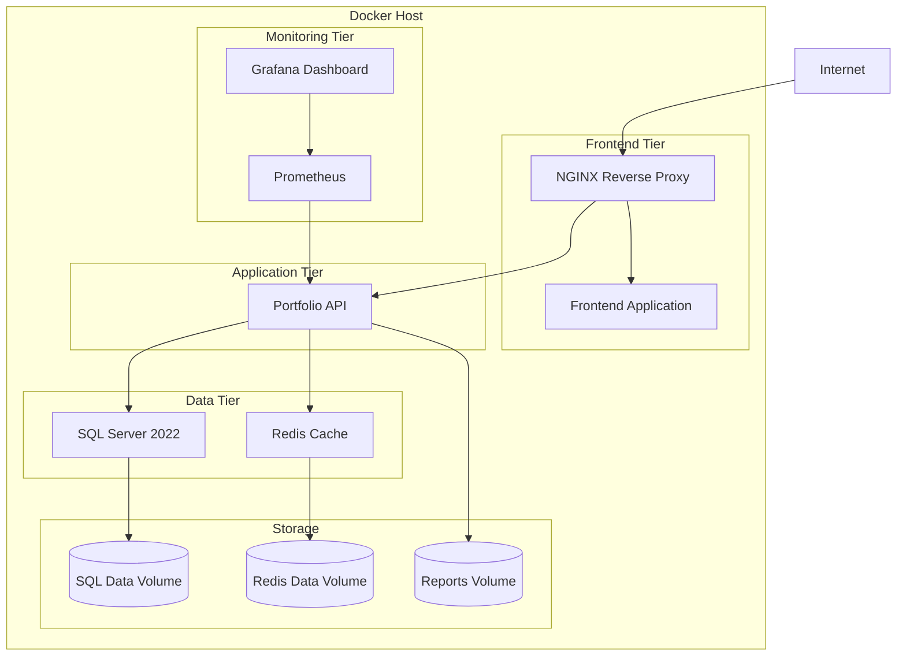

# Docker Deployment Guide

## Overview

This guide provides comprehensive instructions for deploying the CDPQ Investment Portfolio Management System using Docker containers with Docker Compose for both development and production environments.

## Architecture



## Prerequisites

### System Requirements

#### Development Environment
- Docker Engine 20.10+
- Docker Compose 2.0+
- 8 GB RAM minimum
- 4 CPU cores
- 50 GB available disk space

#### Production Environment
- Docker Engine 20.10+
- Docker Compose 2.0+
- 16 GB RAM minimum
- 8 CPU cores
- 200 GB available disk space
- SSL certificates

### Network Requirements
- Ports 80, 443 available for web traffic
- Ports 1433, 6379 for database access (internal)
- Firewall configured appropriately

## Quick Start

### Development Environment

```bash
# Clone the repository
git clone https://github.com/cdpq/investment-portfolio-manager.git
cd investment-portfolio-manager

# Copy environment file
cp .env.example .env

# Build and start services
docker-compose up -d

# View logs
docker-compose logs -f api

# Stop services
docker-compose down
```

### Production Environment

```bash
# Copy production environment file
cp .env.production.example .env.production

# Update environment variables
nano .env.production

# Start production services
docker-compose -f docker-compose.prod.yml up -d

# Verify deployment
docker-compose -f docker-compose.prod.yml ps
```

## Configuration Files

### Environment Variables

#### Development (`.env`)
```bash
# Application
ASPNETCORE_ENVIRONMENT=Development
API_PORT=5000
FRONTEND_PORT=3000

# Database
SQL_SERVER_SA_PASSWORD=YourStrong@Passw0rd
DATABASE_NAME=InvestmentPortfolioDB

# Redis
REDIS_PASSWORD=

# JWT Settings
JWT_SECRET_KEY=your-256-bit-secret-key-here
JWT_ISSUER=https://localhost:5000
JWT_AUDIENCE=portfolio-api

# Logging
LOG_LEVEL=Debug

# Features
ENABLE_SWAGGER=true
ENABLE_DETAILED_ERRORS=true
```

#### Production (`.env.production`)
```bash
# Application
ASPNETCORE_ENVIRONMENT=Production
API_PORT=80
FRONTEND_PORT=80
DOMAIN=portfolio.cdpq.com

# Database
SQL_SERVER_SA_PASSWORD=YourVeryStrong@ProductionPassw0rd!
DATABASE_NAME=InvestmentPortfolioDB

# Redis
REDIS_PASSWORD=YourRedisPassword123!

# JWT Settings
JWT_SECRET_KEY=your-very-secure-256-bit-production-secret-key
JWT_ISSUER=https://api.portfolio.cdpq.com
JWT_AUDIENCE=portfolio-api

# SSL
SSL_CERT_PATH=/etc/ssl/certs/portfolio.crt
SSL_KEY_PATH=/etc/ssl/private/portfolio.key

# Monitoring
PROMETHEUS_ENABLED=true
GRAFANA_ADMIN_PASSWORD=SecureGrafanaPassword!

# Logging
LOG_LEVEL=Warning
```

### Docker Compose Services

#### Development Services (`docker-compose.yml`)

1. **SQL Server 2022**
   - Image: `mcr.microsoft.com/mssql/server:2022-latest`
   - Port: 1433
   - Volume: `sql_data`

2. **Redis Cache**
   - Image: `redis:7-alpine`
   - Port: 6379
   - Volume: `redis_data`

3. **Portfolio API**
   - Build: Local Dockerfile
   - Port: 5000
   - Depends on: SQL Server, Redis

4. **Frontend (Optional)**
   - Build: Frontend Dockerfile
   - Port: 3000

#### Production Services (`docker-compose.prod.yml`)

Additional services for production:

5. **NGINX Reverse Proxy**
   - SSL termination
   - Load balancing
   - Static file serving

6. **Prometheus Monitoring**
   - Metrics collection
   - Service discovery

7. **Grafana Dashboard**
   - Visualization
   - Alerting

## Detailed Deployment

### 1. Prepare Environment

#### Create Directory Structure
```bash
mkdir -p /opt/portfolio/{data,logs,ssl,backups}
cd /opt/portfolio
```

#### Set Permissions
```bash
# Create application user
sudo useradd -r -s /bin/false portfolio

# Set ownership
sudo chown -R portfolio:portfolio /opt/portfolio
sudo chmod -R 755 /opt/portfolio
```

### 2. SSL Certificates (Production)

#### Using Let's Encrypt
```bash
# Install certbot
sudo apt install certbot

# Generate certificate
sudo certbot certonly --standalone -d api.portfolio.cdpq.com

# Copy certificates
sudo cp /etc/letsencrypt/live/api.portfolio.cdpq.com/fullchain.pem /opt/portfolio/ssl/
sudo cp /etc/letsencrypt/live/api.portfolio.cdpq.com/privkey.pem /opt/portfolio/ssl/
sudo chown portfolio:portfolio /opt/portfolio/ssl/*
```

#### Using Custom Certificates
```bash
# Copy your certificates
cp portfolio.crt /opt/portfolio/ssl/
cp portfolio.key /opt/portfolio/ssl/
chmod 644 /opt/portfolio/ssl/portfolio.crt
chmod 600 /opt/portfolio/ssl/portfolio.key
```

### 3. Build Application

#### Development Build
```bash
# Build API image
docker-compose build api

# Or build with cache disabled
docker-compose build --no-cache api
```

#### Production Build
```bash
# Build production images
docker-compose -f docker-compose.prod.yml build

# Tag for registry (optional)
docker tag portfolio-api:latest your-registry.com/portfolio-api:v1.0.0
docker push your-registry.com/portfolio-api:v1.0.0
```

### 4. Database Initialization

#### First-Time Setup
```bash
# Start only the database
docker-compose up -d sqlserver

# Wait for SQL Server to be ready
docker-compose logs -f sqlserver

# Run database migrations (if using Entity Framework)
docker-compose run --rm api dotnet ef database update

# Or import initial data
docker-compose exec sqlserver /opt/mssql-tools/bin/sqlcmd \
  -S localhost -U sa -P $SQL_SERVER_SA_PASSWORD \
  -i /var/opt/mssql/scripts/init.sql
```

### 5. Start Services

#### Development
```bash
# Start all services
docker-compose up -d

# View service status
docker-compose ps

# Follow logs
docker-compose logs -f

# Access specific service logs
docker-compose logs -f api
docker-compose logs -f sqlserver
```

#### Production
```bash
# Start production services
docker-compose -f docker-compose.prod.yml up -d

# Verify all services are running
docker-compose -f docker-compose.prod.yml ps

# Check health status
curl -f http://localhost/health || exit 1
```

## Service Management

### Starting and Stopping

#### Individual Services
```bash
# Start specific service
docker-compose start api

# Stop specific service
docker-compose stop api

# Restart service
docker-compose restart api

# Force recreate service
docker-compose up -d --force-recreate api
```

#### All Services
```bash
# Start all services
docker-compose up -d

# Stop all services
docker-compose stop

# Stop and remove containers
docker-compose down

# Stop and remove containers with volumes
docker-compose down -v
```

### Scaling Services

#### Scale API Instances
```bash
# Scale to 3 API instances
docker-compose up -d --scale api=3

# For production with load balancer
docker-compose -f docker-compose.prod.yml up -d --scale api=3
```

## Monitoring and Logging

### Health Checks

#### Application Health
```bash
# Check API health
curl http://localhost:5000/health

# Detailed health check
curl http://localhost:5000/health/detailed

# Ready check
curl http://localhost:5000/health/ready
```

#### Container Health
```bash
# Check container status
docker-compose ps

# View container health
docker inspect --format='{{.State.Health.Status}}' portfolio_api_1
```

### Viewing Logs

#### Application Logs
```bash
# All services
docker-compose logs

# Specific service
docker-compose logs api

# Follow logs
docker-compose logs -f api

# Last 100 lines
docker-compose logs --tail=100 api

# Since timestamp
docker-compose logs --since="2024-01-01T00:00:00" api
```

#### System Logs
```bash
# Docker daemon logs
journalctl -u docker.service -f

# Container logs directly
docker logs container_name

# Export logs
docker-compose logs api > api_logs.txt
```

### Performance Monitoring

#### Resource Usage
```bash
# Container resource usage
docker stats

# Specific container stats
docker stats portfolio_api_1

# Export stats
docker stats --no-stream --format "table {{.Container}}\t{{.CPUPerc}}\t{{.MemUsage}}" > stats.txt
```

#### Database Monitoring
```bash
# SQL Server performance
docker-compose exec sqlserver /opt/mssql-tools/bin/sqlcmd \
  -S localhost -U sa -P $SQL_SERVER_SA_PASSWORD \
  -Q "SELECT * FROM sys.dm_os_performance_counters WHERE counter_name LIKE '%CPU%'"

# Redis monitoring
docker-compose exec redis redis-cli info
docker-compose exec redis redis-cli monitor
```

## Backup and Recovery

### Database Backup

#### Automated Backup Script
```bash
#!/bin/bash
# backup-database.sh

BACKUP_DIR="/opt/portfolio/backups"
DATE=$(date +%Y%m%d_%H%M%S)
BACKUP_FILE="portfolio_backup_$DATE.bak"

# Create backup
docker-compose exec sqlserver /opt/mssql-tools/bin/sqlcmd \
  -S localhost -U sa -P $SQL_SERVER_SA_PASSWORD \
  -Q "BACKUP DATABASE [InvestmentPortfolioDB] TO DISK = '/var/opt/mssql/backup/$BACKUP_FILE'"

# Copy to host
docker cp portfolio_sqlserver_1:/var/opt/mssql/backup/$BACKUP_FILE $BACKUP_DIR/

# Clean old backups (keep last 7 days)
find $BACKUP_DIR -name "portfolio_backup_*.bak" -mtime +7 -delete

echo "Backup completed: $BACKUP_FILE"
```

#### Manual Backup
```bash
# Create backup
docker-compose exec sqlserver /opt/mssql-tools/bin/sqlcmd \
  -S localhost -U sa -P $SQL_SERVER_SA_PASSWORD \
  -Q "BACKUP DATABASE [InvestmentPortfolioDB] TO DISK = '/var/opt/mssql/backup/manual_backup.bak'"

# Copy to host
docker cp portfolio_sqlserver_1:/var/opt/mssql/backup/manual_backup.bak ./
```

### Volume Backup

#### Backup Persistent Data
```bash
# Stop services
docker-compose stop

# Create volume backup
docker run --rm -v portfolio_sql_data:/data -v $(pwd):/backup alpine \
  tar czf /backup/sql_data_backup.tar.gz -C /data .

docker run --rm -v portfolio_redis_data:/data -v $(pwd):/backup alpine \
  tar czf /backup/redis_data_backup.tar.gz -C /data .

# Start services
docker-compose up -d
```

#### Restore from Backup
```bash
# Stop services
docker-compose down

# Remove existing volumes
docker volume rm portfolio_sql_data portfolio_redis_data

# Restore volumes
docker volume create portfolio_sql_data
docker run --rm -v portfolio_sql_data:/data -v $(pwd):/backup alpine \
  tar xzf /backup/sql_data_backup.tar.gz -C /data

docker volume create portfolio_redis_data
docker run --rm -v portfolio_redis_data:/data -v $(pwd):/backup alpine \
  tar xzf /backup/redis_data_backup.tar.gz -C /data

# Start services
docker-compose up -d
```

## Security

### Container Security

#### Security Best Practices
- Run containers as non-root user
- Use read-only root filesystems where possible
- Limit container capabilities
- Use security scanning tools

#### Security Scanning
```bash
# Scan images for vulnerabilities
docker scout cves portfolio-api:latest

# Scan with Trivy
trivy image portfolio-api:latest

# Scan with Clair
clair-scanner portfolio-api:latest
```

### Network Security

#### Internal Network
- Services communicate on internal Docker network
- Database ports not exposed to host
- Redis not accessible externally

#### Firewall Configuration
```bash
# Allow HTTP/HTTPS
sudo ufw allow 80/tcp
sudo ufw allow 443/tcp

# Block direct database access
sudo ufw deny 1433/tcp
sudo ufw deny 6379/tcp
```

### Secrets Management

#### Using Docker Secrets
```bash
# Create secrets
echo "YourStrong@Passw0rd" | docker secret create db_password -
echo "your-jwt-secret-key" | docker secret create jwt_key -

# Use in compose file
services:
  api:
    secrets:
    - db_password
    - jwt_key
```

## Troubleshooting

### Common Issues

#### Container Won't Start
```bash
# Check container logs
docker-compose logs api

# Check container configuration
docker-compose config

# Validate compose file
docker-compose -f docker-compose.yml config
```

#### Database Connection Issues
```bash
# Test database connectivity
docker-compose exec api nc -zv sqlserver 1433

# Check SQL Server logs
docker-compose logs sqlserver

# Test SQL connection
docker-compose exec sqlserver /opt/mssql-tools/bin/sqlcmd \
  -S localhost -U sa -P $SQL_SERVER_SA_PASSWORD -Q "SELECT 1"
```

#### Performance Issues
```bash
# Check resource usage
docker stats

# Check disk space
df -h

# Check memory usage
free -h

# Check container limits
docker inspect api_container | grep -i memory
```

### Debugging Commands

```bash
# Execute commands in container
docker-compose exec api bash

# View container details
docker inspect portfolio_api_1

# Check network connectivity
docker-compose exec api ping sqlserver

# View environment variables
docker-compose exec api env

# Check file permissions
docker-compose exec api ls -la /app
```

## Updates and Maintenance

### Application Updates

#### Rolling Update
```bash
# Pull latest code
git pull origin main

# Build new image
docker-compose build api

# Update with zero downtime (if using multiple instances)
docker-compose up -d --no-deps api

# Or force recreate
docker-compose up -d --force-recreate api
```

#### Database Migrations
```bash
# Run migrations
docker-compose run --rm api dotnet ef database update

# Or with custom connection
docker-compose run --rm api dotnet ef database update \
  --connection "Server=sqlserver,1433;Database=InvestmentPortfolioDB;User Id=sa;Password=$SQL_SERVER_SA_PASSWORD;"
```

### System Maintenance

#### Clean Up Resources
```bash
# Remove unused containers
docker container prune

# Remove unused images
docker image prune

# Remove unused volumes
docker volume prune

# Remove unused networks
docker network prune

# Clean everything
docker system prune -a
```

#### Update Base Images
```bash
# Pull latest base images
docker-compose pull

# Rebuild with latest base images
docker-compose build --pull
```

## Production Considerations

### High Availability

#### Load Balancing
- Use NGINX for load balancing multiple API instances
- Configure health checks
- Implement session affinity if needed

#### Database Clustering
- Consider SQL Server Always On Availability Groups
- Implement read replicas for reporting
- Configure automatic failover

### Performance Optimization

#### Resource Limits
```yaml
services:
  api:
    deploy:
      resources:
        limits:
          cpus: '2.0'
          memory: 4G
        reservations:
          cpus: '1.0'
          memory: 2G
```

#### Caching Strategy
- Configure Redis with appropriate memory limits
- Implement application-level caching
- Use CDN for static assets

### Monitoring and Alerting

#### Prometheus Metrics
```yaml
services:
  prometheus:
    image: prom/prometheus
    ports:
    - "9090:9090"
    volumes:
    - ./monitoring/prometheus.yml:/etc/prometheus/prometheus.yml
```

#### Grafana Dashboards
```yaml
services:
  grafana:
    image: grafana/grafana
    ports:
    - "3001:3000"
    environment:
    - GF_SECURITY_ADMIN_PASSWORD=admin
    volumes:
    - grafana_data:/var/lib/grafana
```

This comprehensive Docker deployment guide provides all necessary information for successfully deploying and managing the CDPQ Investment Portfolio Management System using Docker containers.