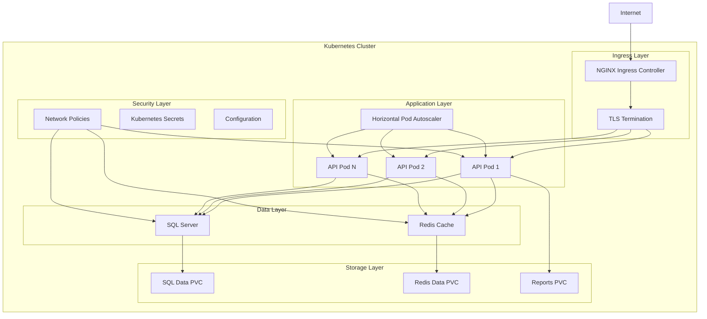

# Kubernetes Deployment Guide

## Overview

This guide provides comprehensive instructions for deploying the CDPQ Investment Portfolio Management System to Kubernetes clusters using Docker containers and Kustomize for configuration management.

## Architecture



## Prerequisites

### Required Tools
- **kubectl**: Kubernetes command-line tool
- **kustomize**: Configuration management tool (v4.0+)
- **docker**: Container runtime
- **helm** (optional): For NGINX Ingress Controller

### Cluster Requirements
- Kubernetes 1.20+
- Storage class supporting ReadWriteOnce and ReadWriteMany
- NGINX Ingress Controller
- Cert-Manager (for SSL certificates)

### Resource Requirements

#### Minimum (Development)
- 4 CPU cores
- 8 GB RAM
- 20 GB storage

#### Production
- 16 CPU cores
- 32 GB RAM
- 200 GB storage

## Quick Start

### 1. Build and Push Docker Image

```bash
# Build the Docker image
docker build -t portfolio-api:latest .

# Tag for your container registry
docker tag portfolio-api:latest your-registry.com/portfolio-api:latest

# Push to container registry
docker push your-registry.com/portfolio-api:latest
```

### 2. Deploy to Development

```bash
# Apply development configuration
kubectl apply -k k8s/overlays/development

# Verify deployment
kubectl get pods -n portfolio-management-dev
kubectl get services -n portfolio-management-dev
```

### 3. Deploy to Production

```bash
# Apply production configuration
kubectl apply -k k8s/overlays/production

# Verify deployment
kubectl get pods -n portfolio-management
kubectl get services -n portfolio-management
```

## Detailed Deployment Steps

### 1. Prepare Container Images

#### Build Application Image
```bash
# From project root directory
docker build -t portfolio-api:v1.0.0 .

# For multi-architecture builds
docker buildx build --platform linux/amd64,linux/arm64 -t portfolio-api:v1.0.0 .
```

#### Push to Container Registry
```bash
# Azure Container Registry
az acr login --name yourregistry
docker tag portfolio-api:v1.0.0 yourregistry.azurecr.io/portfolio-api:v1.0.0
docker push yourregistry.azurecr.io/portfolio-api:v1.0.0

# AWS ECR
aws ecr get-login-password --region region | docker login --username AWS --password-stdin account.dkr.ecr.region.amazonaws.com
docker tag portfolio-api:v1.0.0 account.dkr.ecr.region.amazonaws.com/portfolio-api:v1.0.0
docker push account.dkr.ecr.region.amazonaws.com/portfolio-api:v1.0.0

# Google Container Registry
gcloud auth configure-docker
docker tag portfolio-api:v1.0.0 gcr.io/project-id/portfolio-api:v1.0.0
docker push gcr.io/project-id/portfolio-api:v1.0.0
```

### 2. Configure Secrets

#### Create Database Passwords
```bash
# Generate strong passwords
kubectl create secret generic api-secrets \
  --from-literal=SA_PASSWORD='YourStrong@Passw0rd123!' \
  --from-literal=JWT_SECRET_KEY='your-very-long-jwt-secret-key-at-least-256-bits' \
  --from-literal=DATA_ENCRYPTION_KEY='your-32-character-encryption-key' \
  -n portfolio-management
```

#### TLS Certificates
```bash
# Using cert-manager (recommended)
kubectl apply -f - <<EOF
apiVersion: cert-manager.io/v1
kind: ClusterIssuer
metadata:
  name: letsencrypt-prod
spec:
  acme:
    server: https://acme-v02.api.letsencrypt.org/directory
    email: admin@cdpq.com
    privateKeySecretRef:
      name: letsencrypt-prod
    solvers:
    - http01:
        ingress:
          class: nginx
EOF

# Or create manually
kubectl create secret tls api-tls-secret \
  --cert=path/to/tls.crt \
  --key=path/to/tls.key \
  -n portfolio-management
```

### 3. Install Prerequisites

#### NGINX Ingress Controller
```bash
# Using Helm
helm repo add ingress-nginx https://kubernetes.github.io/ingress-nginx
helm repo update
helm install ingress-nginx ingress-nginx/ingress-nginx \
  --namespace ingress-nginx \
  --create-namespace

# Or using kubectl
kubectl apply -f https://raw.githubusercontent.com/kubernetes/ingress-nginx/controller-v1.8.4/deploy/static/provider/cloud/deploy.yaml
```

#### Cert-Manager
```bash
# Install cert-manager
kubectl apply -f https://github.com/cert-manager/cert-manager/releases/download/v1.13.2/cert-manager.yaml
```

### 4. Deploy Application

#### Development Environment
```bash
# Create namespace
kubectl create namespace portfolio-management-dev

# Apply development configuration
kubectl apply -k k8s/overlays/development

# Wait for deployment
kubectl rollout status deployment/dev-api -n portfolio-management-dev
kubectl rollout status deployment/dev-sql-server -n portfolio-management-dev
kubectl rollout status deployment/dev-redis -n portfolio-management-dev
```

#### Production Environment
```bash
# Create namespace
kubectl create namespace portfolio-management

# Apply production configuration
kubectl apply -k k8s/overlays/production

# Wait for deployment
kubectl rollout status deployment/prod-api -n portfolio-management
kubectl rollout status deployment/prod-sql-server -n portfolio-management
kubectl rollout status deployment/prod-redis -n portfolio-management
```

### 5. Verify Deployment

#### Check Pod Status
```bash
# Development
kubectl get pods -n portfolio-management-dev
kubectl describe pod <pod-name> -n portfolio-management-dev

# Production
kubectl get pods -n portfolio-management
kubectl describe pod <pod-name> -n portfolio-management
```

#### Check Services
```bash
# Development
kubectl get services -n portfolio-management-dev

# Production
kubectl get services -n portfolio-management
```

#### Check Ingress
```bash
# Development
kubectl get ingress -n portfolio-management-dev

# Production
kubectl get ingress -n portfolio-management
```

#### Health Checks
```bash
# Port forward to test locally
kubectl port-forward service/api-service 8080:80 -n portfolio-management

# Test health endpoint
curl http://localhost:8080/health

# Or test via ingress
curl https://api.portfolio.cdpq.com/health
```

## Configuration Management

### Environment-Specific Configurations

#### Development (`k8s/overlays/development/`)
- Single replica for cost optimization
- Debug logging enabled
- Swagger UI enabled
- Local development CORS settings
- Reduced resource limits

#### Production (`k8s/overlays/production/`)
- Multiple replicas for high availability
- Warning-level logging
- Swagger UI disabled
- Enhanced security headers
- Production resource limits
- Horizontal Pod Autoscaling

### Customizing Configurations

#### Update Image Tags
```bash
# Edit kustomization.yaml
cd k8s/overlays/production
kustomize edit set image portfolio-api=yourregistry.com/portfolio-api:v1.0.1
```

#### Update Configuration
```bash
# Edit configmap patches
vi k8s/overlays/production/configmap-patch.yaml

# Apply changes
kubectl apply -k k8s/overlays/production
```

## Monitoring & Observability

### Health Checks
- **Liveness Probe**: `/health` endpoint
- **Readiness Probe**: `/health/ready` endpoint
- **Startup Probe**: `/health` endpoint with extended timeout

### Metrics
```bash
# View HPA metrics
kubectl get hpa -n portfolio-management

# View resource usage
kubectl top pods -n portfolio-management
kubectl top nodes
```

### Logs
```bash
# View application logs
kubectl logs -f deployment/prod-api -n portfolio-management

# View all container logs in a pod
kubectl logs -f <pod-name> -c api -n portfolio-management

# Stream logs from multiple pods
kubectl logs -f -l app.kubernetes.io/component=api -n portfolio-management
```

## Scaling

### Manual Scaling
```bash
# Scale API deployment
kubectl scale deployment prod-api --replicas=5 -n portfolio-management

# Scale using patch
kubectl patch deployment prod-api -p '{"spec":{"replicas":5}}' -n portfolio-management
```

### Horizontal Pod Autoscaling
The HPA is configured to:
- Minimum 3 replicas (production)
- Maximum 20 replicas (production)
- Scale on CPU utilization (70%)
- Scale on memory utilization (80%)

### Vertical Pod Autoscaling
```bash
# Install VPA (if not already installed)
kubectl apply -f https://github.com/kubernetes/autoscaler/releases/download/vertical-pod-autoscaler-0.13.0/vpa-release-0.13.0.yaml

# Create VPA resource
apiVersion: autoscaling.k8s.io/v1
kind: VerticalPodAutoscaler
metadata:
  name: api-vpa
spec:
  targetRef:
    apiVersion: apps/v1
    kind: Deployment
    name: prod-api
  updatePolicy:
    updateMode: "Auto"
```

## Security

### Network Policies
- API pods can only communicate with database and cache
- Database pods only accept connections from API pods
- Cache pods only accept connections from API pods
- All pods can reach DNS and external HTTPS endpoints

### Pod Security
- Non-root user execution
- Read-only root filesystem
- No privilege escalation
- Capabilities dropped
- Security context configured

### Secrets Management
- Database passwords stored in Kubernetes secrets
- JWT signing keys stored securely
- TLS certificates managed by cert-manager
- No secrets in environment variables or logs

## Backup & Recovery

### Database Backup
```bash
# Create backup job
kubectl create job --from=cronjob/sql-backup manual-backup-$(date +%Y%m%d-%H%M%S) -n portfolio-management

# Manual backup
kubectl exec -it deployment/prod-sql-server -n portfolio-management -- \
  /opt/mssql-tools/bin/sqlcmd -S localhost -U sa -P $SA_PASSWORD \
  -Q "BACKUP DATABASE [InvestmentPortfolioDB] TO DISK = '/var/opt/mssql/backup/portfolio.bak'"
```

### Persistent Volume Backup
```bash
# Using Velero (recommended)
velero backup create portfolio-backup \
  --include-namespaces portfolio-management \
  --include-resources persistentvolumeclaims,persistentvolumes

# Restore from backup
velero restore create --from-backup portfolio-backup
```

## Troubleshooting

### Common Issues

#### Pod Stuck in Pending
```bash
# Check node resources
kubectl describe nodes

# Check PVC status
kubectl get pvc -n portfolio-management

# Check events
kubectl get events -n portfolio-management --sort-by='.lastTimestamp'
```

#### Database Connection Issues
```bash
# Check SQL Server logs
kubectl logs deployment/prod-sql-server -n portfolio-management

# Test connectivity
kubectl exec -it deployment/prod-api -n portfolio-management -- \
  /opt/mssql-tools/bin/sqlcmd -S sql-server-service -U sa -P $SA_PASSWORD -Q "SELECT 1"
```

#### SSL Certificate Issues
```bash
# Check certificate status
kubectl describe certificate api-tls-secret -n portfolio-management

# Check cert-manager logs
kubectl logs -f deployment/cert-manager -n cert-manager
```

### Debugging Commands
```bash
# Get comprehensive status
kubectl get all -n portfolio-management

# Check resource usage
kubectl top pods -n portfolio-management

# View detailed pod information
kubectl describe pod <pod-name> -n portfolio-management

# Execute commands in pod
kubectl exec -it <pod-name> -n portfolio-management -- /bin/bash

# Port forward for local testing
kubectl port-forward service/api-service 8080:80 -n portfolio-management
```

## Updates & Maintenance

### Rolling Updates
```bash
# Update image tag in kustomization
kustomize edit set image portfolio-api=yourregistry.com/portfolio-api:v1.0.2

# Apply update
kubectl apply -k k8s/overlays/production

# Monitor rollout
kubectl rollout status deployment/prod-api -n portfolio-management

# Rollback if needed
kubectl rollout undo deployment/prod-api -n portfolio-management
```

### Maintenance Windows
```bash
# Scale down for maintenance
kubectl scale deployment prod-api --replicas=0 -n portfolio-management

# Perform maintenance tasks
# ...

# Scale back up
kubectl scale deployment prod-api --replicas=3 -n portfolio-management
```

## Performance Optimization

### Resource Tuning
- Monitor actual resource usage with `kubectl top`
- Adjust requests and limits based on observed patterns
- Use VPA for automatic resource optimization

### Database Optimization
- Configure appropriate SQL Server memory limits
- Use appropriate storage class for performance
- Monitor database performance metrics

### Caching Strategy
- Redis configured with appropriate memory limits
- LRU eviction policy for cache optimization
- Monitor cache hit rates

## Cost Optimization

### Development Environment
- Use smaller instance types
- Reduce replica counts
- Use node selectors for cost-effective nodes

### Production Environment
- Use Horizontal Pod Autoscaling to scale down during low usage
- Consider spot instances for non-critical workloads
- Optimize storage class selection

## Compliance & Governance

### CDPQ Requirements
- All data remains within specified regions
- Audit logging enabled
- Encryption at rest and in transit
- Role-based access control

### Monitoring & Alerts
- Set up alerts for pod failures
- Monitor resource utilization
- Track application performance metrics
- Configure security scanning

This comprehensive guide provides all necessary information for deploying and managing the CDPQ Investment Portfolio Management System on Kubernetes clusters.